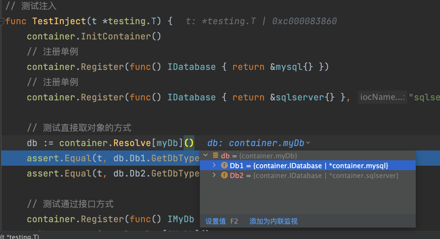

# container容器
> 包：`"github.com/farseer-go/fs/container"`

在使用容器时，先定义一个interface、以及实现该接口的struct

_IDatabase.go 接口_
```go
// 接口
type IDatabase interface {
    SetTableName(tableName string)
    GetTableName() string
    GetDbType() string
}
```
_mysql.go 实现IDatabase接口_
```go
type mysql struct {
    tableName string
}

func (r *mysql) SetTableName(tableName string) { r.tableName = tableName }
func (r *mysql) GetTableName() string          { return r.tableName }
func (r *mysql) GetDbType() string             { return "mysql" }
```

_sqlserver.go 实现IDatabase接口_
```go
type sqlserver struct {
    tableName string
}

func (r *sqlserver) SetTableName(tableName string) { r.tableName = tableName }
func (r *sqlserver) GetTableName() string          { return r.tableName }
func (r *sqlserver) GetDbType() string             { return "sqlserver" }
```
这里我们模拟一个数据库ORM，支持sqlserver、mysql。

## 注册单例
```go
container.Register(func() IDatabase { return &mysql{} })
```
`container.Register`函数 要求传入一个`func函数`，该函数要求`返回interface类型`（示例中的是IDatabase）。函数体就是你如何实例化这个对象

这样我们就注册了一个`单例`IDatabase接口的容器


## 注册临时对象
要注册临时对象：
```go
container.RegisterTransient(func() IDatabase { return &mysql{} })
```
当调用了`RegisterTransient`时，意味着当前注册的对象为`临时对象`，每次获取注册的容器时，都会执行一遍func()函数

## 注册多实例

对于应用来说，大部份的使用场景都是一对一的。但有时候我们还是需要`一个接口对应多个不同的实现`，比如`工厂模式`。

```go
// 注册单例
container.Register(func() IDatabase { return &mysql{} }, "mysql")
// 注册单例
container.Register(func() IDatabase { return &sqlserver{} }, "sqlserver")
```

通过`第二个参数`，可以为注册的实例增加`别名属性`。如上面例子`注册了两个实例`。

这时我们可以通过`container.Resolve`函数，获取`不同别名的实现`：
```go
mysql := container.Resolve[IDatabase]("mysql")
sqlserver := container.Resolve[IDatabase]("sqlserver")
```

## 注册函数
更高级的用法是，在获取实现类的时候，它是经过一些逻辑而得出的，这时我们可以使用函数的方式注册。

这个注册与面前的注册是一样的，我们先定义一个接口、实现类、以及要注册的函数
```go
type IDatabaseFactory interface {
    CreateDatabase() IDatabase
}

type databaseFactory struct { }

func (d *databaseFactory) CreateDatabase() IDatabase {
    return &sqlserver{}
}

// 注册的函数
func createDb(factory IDatabaseFactory) IDatabase {
    return factory.CreateDatabase()
}
```
我们新定义了一个`IDatabaseFactory`接口，一个实现类：`databaseFactory`，以及一个普通函数`createDb`

`createDb`的入参，要求传入一个接口，然后返回`IDatabase`接口。

接着，我们来注册这个`createDb`函数。

```go
// 注册获取IDatabase接口的方法
container.Register(createDb)
// 注册IDatabaseFactory接口实例
container.Register(func() IDatabaseFactory { return &databaseFactory{} })
```
通过注册了`createDb`、`IDatabaseFactory`。这时我们就可以获取`IDatabase`的实例了：
```go
container.Resolve[IDatabase]().GetDbType() // return "sqlserver"
```
通获取IDatabase实例时，容器会去查找获取IDatabase接口的函数实现，这里找到了之前注册的`createDb`函数。因为`createDb`函数返回的是`IDatabase`接口

接着，`createDb`函数的入参需要传入：`IDatabaseFactory`的实现。这时容器会去查找`IDatabaseFactory`的实现，自动获取后并传入这个参数。


## 获取实例
```go
instance:= container.Resolve[IDatabase]()
```
`container.Resolve`接受一个泛型，这个泛型传入我们需要获取实例对象的`继承接口`。

这样我们就可以拿到IDatabase的实例了。

!> 使用容器，可以使得我们的接口与实现进行解耦，让我们的代码更清晰。很好的实现了`依赖倒置`的设计原则

知识扩充：

?> 比如我们可以将IDatabase`接口放在domain领域层`，而`实现放在infrastructure基础设施层`，做到完全的分离。

## 属性注入
在container组件中要实现注入的方式非常简单，我们先定义一个结构：
```go
type myDb struct {
	Db1 IDatabase
	Db2 IDatabase `inject:"sqlserver"`
}
```
可以看到这个结构体有2个字段，同时他们都是Interface类型。在获取时，container容器就会尝试去注入这两个字段。

如果你希望指定别名时，可以通过`inject标签`来指定。

```go
// 注册单例
container.Register(func () IDatabase { return &mysql{} })
// 注册单例
container.Register(func () IDatabase { return &sqlserver{} }, "sqlserver")

// 测试直接取对象的方式
db := container.Resolve[myDb]()
```



如图，myDb的结构体中，Db1、Db2都被自动注入了属性。

?> 事实上，只要通过container.Resolve或者通过注入获取到的接口实例，都会去查找这个对象的（结构体）中，是否存在为nil的接口类型字段，满足这个条件就会执行注入。

```go
package repository

func RegisterProductRepository() {
	container.Register(func() product.Repository {
		return &productRepository{}
	})
}

type productRepository struct {
	DB cache.ICacheManage[product.DomainObject] `inject:"product"`
}

func (p *productRepository) ToEntity(productId int) product.DomainObject {
	item, _ := p.DB.GetItem(productId)
	return item
}
```

在这个代码示例中，`productRepository`结构体中包含了：`DB`字段，并设置标签：`inject:"product"`

同时`RegisterProductRepository`函数会执行注册这个实现到`product.Repository`接口中。

当前端通过container.Resolve调用这个接口，DB字段会被自动注入：


!> 可以发现，容器的属性注入使用好了，可以为我们节省大量的代码。
