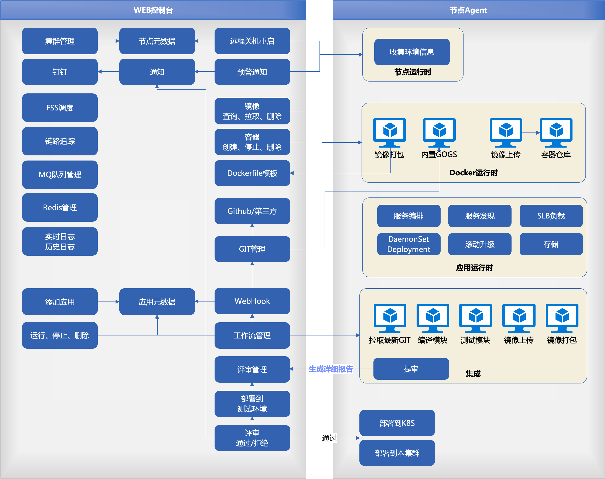

# 架构设计
英文：`Nebula`，中文：`星云`。意为在宇宙浩瀚中将各个星球组织成云网络

## 划分

整个架构分为： `master节点`、`node节点`

部署时，需先部署master节点。然后再部署node节点。

master节点部署成功后，将打印出集群的KEY。node节点启动时根据传入的KEY加入到集群中。

KEY主要是包含etcd的地址
### master节点
master负责对所有节点的通讯管理、容器管理、服务编排、服务监控、应用管理、应用构建、Docker仓库、节点升级

master同时启动etcd服务，用于所有节点的注册信息。

master节点使用GRPC协议控制node节点，但`node节点不能主动请求master节点直接通信`，以保证master挂了之后，不影响到node节点。

master提供api，用于UI页面的控制

### node节点
负责应用的运行时、网络流量入口

node节点将根据所有节点的注册信息，应用信息，做流量的负载均衡。

在将当前节点的请求转发到其它节点时，使用Grpc协议通知其它节点执行。

## 容器运行
master节点和node节点属于同一个应用程序，在启动时根据启动参数来决定切换到哪个角色。

应用程序运行在Docker中。