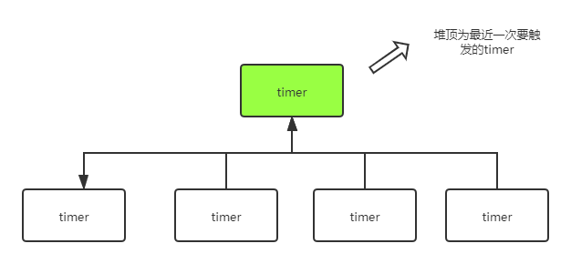
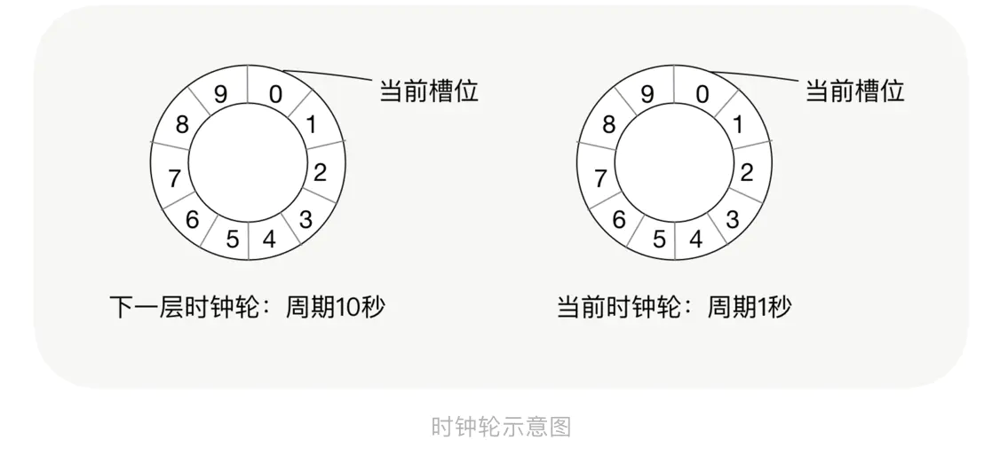
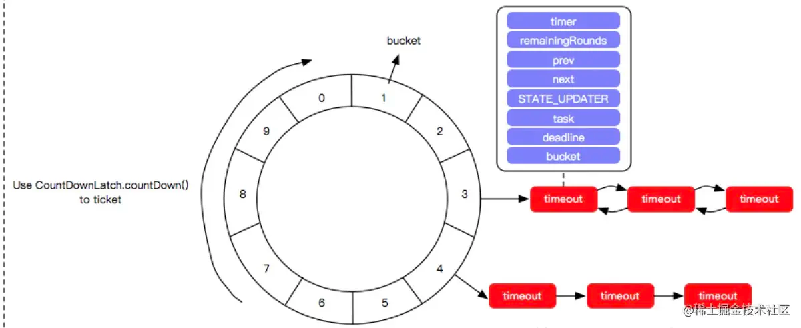
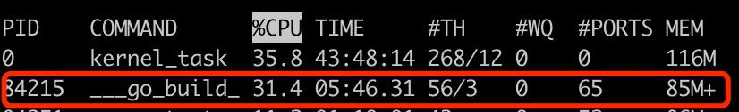

# `优化time.After，项目性能提升34%，内存减少67%`
大家好，今天给大家带来一篇如何优化`time.After`函数。

最近我在做调度中心2.0的重构。本次重构使用的GO语言开发。

在项目中，基本都离不开需要休眠等待一定时间后再执行下一步逻辑的操作，再搭配select，用起来是真的舒服。

```go
func waitWorking() {
    select {
    case <-time.After(5 * time.Second): // 每隔5秒，主动向客户端询问任务状态
        _ = receiver.CheckWorkingEventBus.Publish(receiver)
    case <-receiver.updated:
    }
}
```
在这个示例中，5秒后会执行`Publish`函数，或者`<-receiver.updated`有数据时退出，这是我们比较常用的方式。

但有一点要注意的是：time.After如果没有被执行到，会导致无法第一时间GC回收内存。

从内存分析中，会看到内存在持续增长，到了一定时间后，才会下降。这个增长幅度随着你的项目请求量而决定。

这是因为当`<-receiver.updated`被触发执行时，导致`time.After(5 * time.Second)`在5秒后才会有数据进来，在这5秒内，time.After创建的NewTimer(d)是无法回收的。

```go
func After(d Duration) <-chan Time {
    return NewTimer(d).C
}
```

明白了这一点之后，我们可以`简单的做一个改进`

## 改进1：
```go
func waitWorking() {
    timer := time.NewTimer(5 * time.Second)
    select {
    case <-timer.C: // 每隔5秒，主动向客户端询问任务状态
        _ = receiver.CheckWorkingEventBus.Publish(receiver)
    case <-receiver.updated:
        timer.Stop()
    }
}
```

当`<-receiver.updated`被触发执行时，我们主动调用`Stop`方法，来告知GC，此timer对象不再使用。

这样就不至于等到5秒后，GC才知道这个对象不再使用。

这就完了吗？显示没有，如果waitWorking函数会在并发中被调用：
```go
type TaskGroupMonitor struct {
    updated chan struct{}   // 数据有更新，让流程重置
	name    string          // 任务名称
}
func (receiver *TaskGroupMonitor) waitWorking() {
    timer := time.NewTimer(5 * time.Second)
    select {
    case <-timer.C: // 每隔5秒，主动向客户端询问任务状态
        _ = receiver.CheckWorkingEventBus.Publish(receiver)
    case <-receiver.updated:
        timer.Stop()
    }
}

func init() {
	// 模拟数据库读到了100条任务
    for i := 0; i < 100; i++ {
		taskGroup:= TaskGroupMonitor{}
        go taskGroup.waitWorking()
    }
}
```
这里假如从数据库中读到了100条任务数据，每条数据都在独立的协程中运行。

这就会导致在这100条任务在运行的过程中，创建了100个time.Timer对象，事实上除了`waitWorking`，还会有`waitStart`，`waitScheduler`，`taskFinish`等函数也使用了time.Timer对象。

可以想到，项目在运行过程中time.Timer在不停的创建，直到GC后才被回收。这将导致我们的内存一直占用着。

并且`time.After`或`time.NewTicker`并不是高精度的时间控制。有时候会慢那么0-3ms，协程数量越多越繁忙，则越不精准。

这对于调度中心而言是无法接收的，我的目标是支持几千个任务同时监控调度。意味着协程数量会非常高。



而在GO的time.Timer中是使用`64个timersBucket`，并使用`四叉堆`来管理各个timer，虽然在1.17版本有所改进。

但时间上仍然没有那么准确，对于调度这种场景来说，对ms级别的延迟也是没办法接受的。

> time.Timer原理不在本篇的范围内，现在有很多大神有这方面的剖析，感兴趣可以去搜搜。

## 分析问题
通过简单的分析，我们已经知道使用time.Timer会有如下缺点：
1. 每个协程需要创建time.Timer（导致内存占用上升）
2. time.Timer会有延迟（对于ms敏感的场景不适用）

即如此，我们是否可以通过`统一的时间管理器`来管理所有的时间触发器呢？

答案是显而易见的，那就是时间轮。

## 时间轮
时间轮是一种实现延迟功能的算法, 它在Linux内核中使用广泛, 是Linux内核定时器的实现方法和基础之一.
时间轮是一种高效来利用线程资源来进行批量化调度的一种调度模型, 把大量的调度任务全部绑定到同一个调度器上, 利用这个调度器来进行所有任务的管理, 触发以及运行.




简单来说，时间轮就是一个模拟时钟的原理。 实现方式有：单层、双层、多层三种方式。

而在双层、多层时间轮中，又有两种算法：一种是不管几层，时间周期是一样的。另一种是低层一圈 = 上层一格（像秒针、分针一样）

在时钟里，秒针走完一圈，分针走一格。分针走完一圈，时针走一格。以此类推。

当秒针走到第X格，会到第X格的队列中找到是否有待执行任务列表，如果有则取出并通知到C变量。

而我在实现这个时间轮就是完全模拟时钟的这种算法来实现的。我与其它开源的时间轮不一样的地方是，我是高精度算法的。

时间轮的原理大概就讲这么多，毕竟不是一个什么新鲜的算法，网上有很多讲的比我更透彻的大神，在这里我主要讲使用时间轮的前后对比。

我们来看看如何使用：
```go
// 在项目中，定义一个全局变量tw，并规定第0层，走一格=100ms，一圈有120格
import "github.com/farseer-go/fs/timingWheel"

var tw = timingWheel.New(100*time.Millisecond, 120)
tw.Start()
```

接着在项目中我们改成时间轮来控制时间：
```go
func (receiver *TaskGroupMonitor) waitWorking() {
	select {
	case <-tw.AddPrecision(60 * time.Second).C:
        _ = receiver.CheckWorkingEventBus.Publish(receiver)
	case <-receiver.updated:
	}
}
```

至此，我们使用了全局tw变量来控制时间的延迟管理。

我们来看下，优化前的情况：


100个并发下调度：平均延迟：`10ms`、CPU：`31.4%`、内存：`115m`

优化后：


100个并发下调度：平均延迟：`1ms`、CPU：`21.7%`、内存：`34.5m`

为此，整体性能提升：`34%`，内存减少：`67%`

相关材料：
* farseer-go开源地址：https://github.com/farseer-go/fs
* 时间轮开源地址：https://github.com/farseer-go/fs/timingWheel
* 调度中心开源地址：https://github.com/FSchedule/FSchedule
