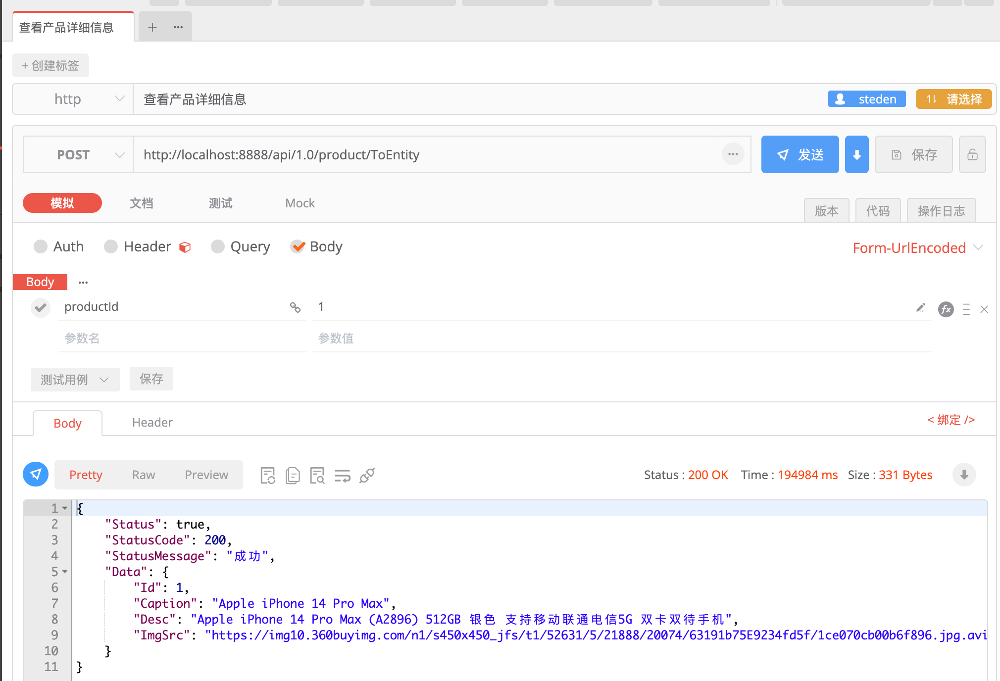
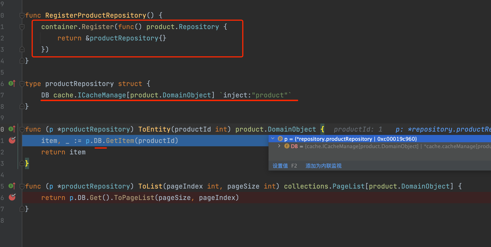

# 容器注入
[English Document](https://farseer-go.gitee.io/en-us/)、[中文文档](https://farseer-go.gitee.io/)、[English Document](https://farseer-go.github.io/doc/en-us/)、[github Source](https://github.com/farseer-go/webapi)

webapi支持对已经注册过的接口自动注入，省去我们手动调用`container.Resolve`，此种注入在实际开发中会更方便。

```go
    fs.Initialize[StartupModule]("demo")
    webapi.Area("/api/1.0/", func () {
        webapi.RegisterPOST("/product/ToEntity", productApp.ToEntity)
    })
    webapi.UseApiResponse()
    webapi.Run()
```

从上方的代码，我们注册了一个`productApp.ToEntity` 动态API。

```go
package productApp

import (
	"fullExample/domain/products/product"
	"github.com/farseer-go/collections"
	"github.com/farseer-go/mapper"
)

// ToEntity 查看产品详细信息
// repository通过container自动注入实现进来
func ToEntity(productId int, repository product.Repository) DTO {
	do := repository.ToEntity(productId)
	dto := mapper.Single[DTO](do)
	return dto
}
```

ToEntity接收两个入参，int、product.Repository（接口）。当前端请求这个接口时，repository参数，会被自动注入：




此时，`repository`参数不需要我们手动去实例化或到container中获取。

当然你也可以手动获取来实现，只是没必要：
```go
func ToEntity(productId int) DTO {
    repository := container.Resolve[product.Repository]()  // 手动获取
	do := repository.ToEntity(productId)
	dto := mapper.Single[DTO](do)
	return dto
}
```
这是不使用注入，而手动获取的方式。该种方式显的麻烦。

接下来我们看下`product.Repository`的实现：


DB字段，也是通过自动注入，拿到实现的。


标签：`inject:"product"`是告诉container，要如何解析这个接口字段。product是别名：

```go
container.Register[cache.ICacheManage[product.DomainObject]](..., "product")
```

在注册时，设置了别名：product

## 什么时候这个属性会被注入？

如果当前这个结构体是通过container容器取出来的，就会去查找这个对象（结构体）字段中，是否有接口类型的字段，并且是已注册到container中的。就会启用属性注入。


完整的代码示例，可以到[这里查看](https://github.com/farseer-go/demo/blob/main/fullExample/main.go)