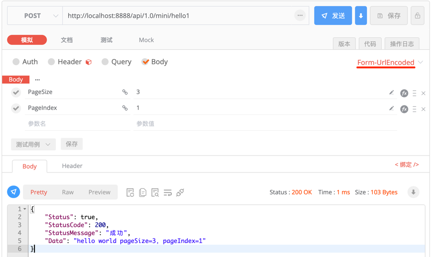
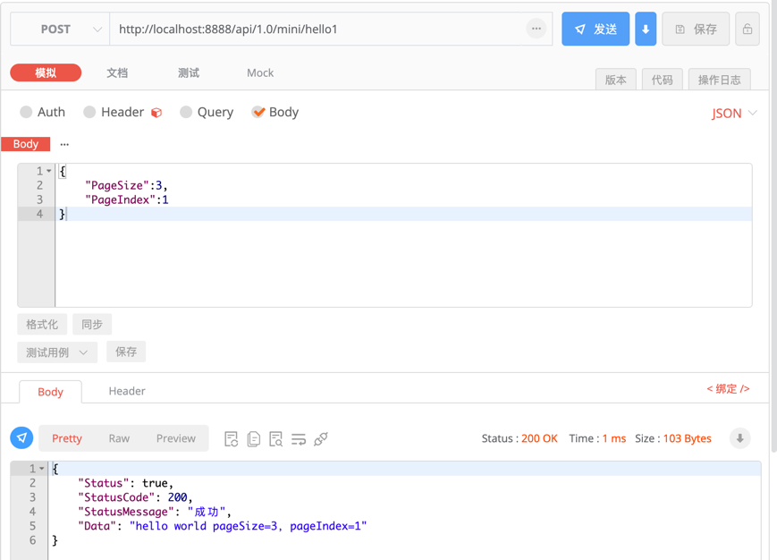
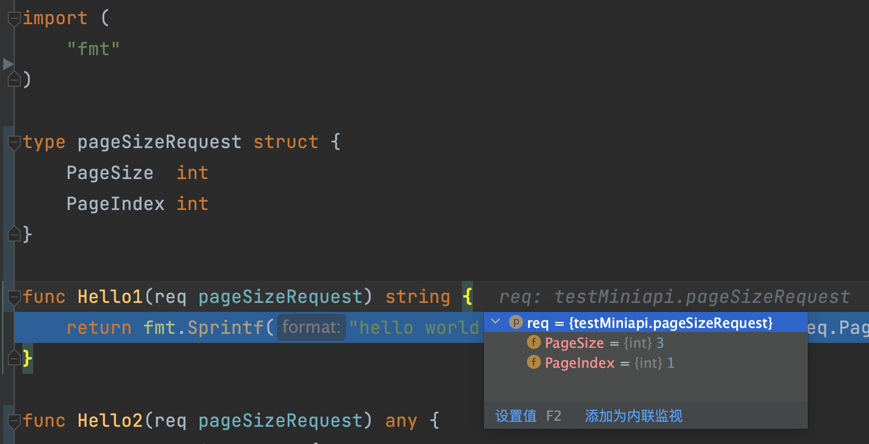
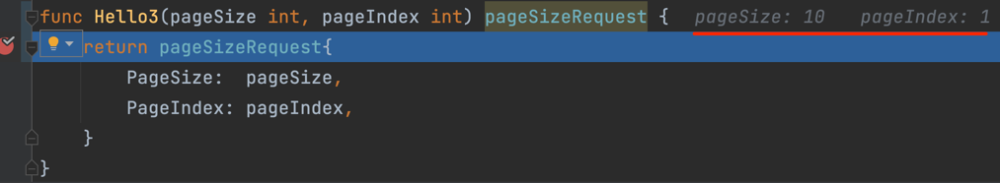

# 入参
[中文文档](https://farseer-go.github.io/doc/)、[English Document](https://farseer-go.github.io/doc/#/en-us/)、[github Source](https://github.com/farseer-go/webapi)

在webapi组件中，Api函数的入参、出参，看起来就是一个普通func函数的参数，并不需要依赖httpRequest、httpResponse。
    
入参支持两种模式：
- **DTO模式**：只有`1个struct`类型时，则会被认为是`model(dto)`模型
- **普通入参**：`不满足DTO模式`时，则会判定为`普通入参`

    ## DTO模式
    支持前端以`application/json`或`x-www-form-urlencoded`方式传值。
- `x-www-form-urlencoded`：

- `application/json`：

- 收到请求：


  ?> 如果是`application/json`，则会自动被反序列化成model，如果是`x-www-form-urlencoded`，则会将每一项的key/value匹配到model字段中

  ## 普通入参
  同样支持前端以`application/json`或`x-www-form-urlencoded`方式传值。
- 收到请求：
  

!> 由于go无法通地反射函数来获取到参数的名称，因此需要显示指定参数的命名，以此来做到参数匹配。这就需要在注册时，显示指定：

```go
webapi.RegisterPOST("/mini/hello3", Hello3, "pageSize", "pageIndex")
```

?> 当入参只有一个时，不需要显示指定参数名称。