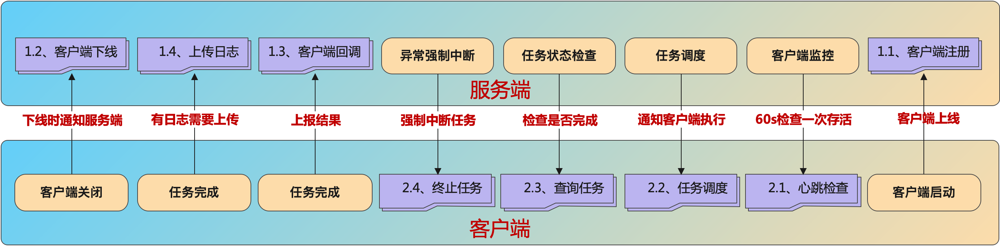

# http协议
fSchedule是为跨语言而设计的调度中心，因此支持使用http协议实现客户端与服务端之间的通讯。

> 事实上官方提供的客户端也是对http的一种封装。


## 1、服务端
服务端暴露的接口，客户端需要对接后请求。

?> 如果服务端配置了访问令牌，则客户端http接入时，需要传入**Header**：`FSchedule-ACCESS-TOKEN`:{访问令牌}

### 1.1、客户端注册

**URL**：`http://调度中心地址/api/registry`

> 客户端启动后向服务端主动注册，以告客户端准备就绪，可接受任务的调度。

**客户端请求Body**：
```json
{
  "ClientId": 204913163484844030,
  "ClientName": "test client",
  "ClientIp": "127.0.0.1",
  "ClientPort": 8888,
  "ClientJobs": [
    {
      "Name": "Hello1",
      "Caption": "测试Hello",
      "Ver": 1,
      "Cron": "0/1 * * * * ?",
      "StartAt": 1674571566,
      "IsEnable": true
    }
  ]
}
```
**服务端响应Body**：
```json
{
  "Status": true,
  "StatusCode": 200,
  "StatusMessage": "成功",
  "Data": []
}
```

任务组版本说明，如果需要向服务端修改任务组属性，则要在原版本号的基础下+1，否则无效。

> 比如原来服务端版本为3，本次想修改caption，则应将ver改为4。这时服务端才会修改，否则忽略。

### 1.2、客户端下线

**URL**：`http://调度中心地址/api/logout`

> 客户端向服务端发送下线通知，下线后的客户端不再接收调度请求

**客户端请求Body**：
```json
{
  "ClientId": 204913163484844030
}
```
**服务端响应Body**：
```json
{
  "Status": true,
  "StatusCode": 200,
  "StatusMessage": "成功",
  "Data": []
}
```

### 1.3、客户端回调

**URL**：`http://调度中心地址/api/taskReport`

> 当客户端处理完任务后，需要回调此接口，告知服务端任务已处理完毕

**客户端请求Body**：
```json
{
  "Id": 1000,
  "Name": "Hello1",
  "NextTimespan": 1676297700768,
  "Progress": 100,
  "Status": 5,
  "RunSpeed": 100,
  "Data": {
    "Key1": "Value1",
    "Key2": "Value2",
    "Key3": "Value3"
  }
}
```
**服务端响应Body**：
```json
{
  "Status": true,
  "StatusCode": 200,
  "StatusMessage": "成功",
  "Data": []
}
```

### 1.4、上传日志

> 客户端上传任务的执行日志

**客户端请求Body**：

**URL**：`http://调度中心地址/api/logReport`

```json
{
  "TaskId": 1000,
  "Name": "Hello1",
  "Log": [
    {
      "LogLevel": 2,
      "Content": "测试日志",
      "CreateAt": 1674571566
    }
  ]
}
```
**服务端响应Body**：
```json
{
  "Status": true,
  "StatusCode": 200,
  "StatusMessage": "成功"
}
```

## 2、客户端

### 2.1、心跳检查

**URL**：`http://客户端内网IP:Port/api/check`

> 服务端会向客户端定时发送心跳请求，以确认客户端是否处于在线状态

**服务端请求Body**：
```json
{
}
```
**客户端响应Body**：
```json
{
  "Status": true,
  "StatusCode": 200,
  "StatusMessage": "成功",
  "Data": {
    "QueueCount": 0,
    "WorkCount": 0,
    "CpuUsage": 20.2,
    "MemoryUsage": 10.5,
    "AllowSchedule": true
  }
}
```

### 2.2、接收任务调度

**URL**：`http://客户端内网IP:Port/api/invoke`

> 服务端会向客户端调度任务，客户端收到后执行任务，执行完后，客户端需要向服务端发起回调，告知任务执行结果

**服务端请求Body**：
```json
{
  "Id": 1000,
  "Name": "Hello1",
  "Caption": "Hello1",
  "StartAt": 1674571566000,
  "Data": {
    "Key1": "Value1",
    "Key2": "Value2",
    "Key3": "Value3"
  }
}
```
**客户端响应Body**：
```json
{
  "Status": true,
  "StatusCode": 200,
  "StatusMessage": "成功",
  "Data": {
    "QueueCount": 0,
    "WorkCount": 0,
    "CpuUsage": 20.2,
    "MemoryUsage": 10.5,
    "AllowSchedule": true
  }
}
```

### 2.3、查询任务状态

**URL**：`http://客户端内网IP:Port/api/status`

> 服务端向客户端发送指定的任务，用于查询任务的当前执行状态

**服务端请求Body**：
```json
{
  "TaskId": 1000
}
```
**客户端响应Body**：
```json
{
  "Status": true,
  "StatusCode": 200,
  "StatusMessage": "成功",
  "Data": {
    "NextTimespan": 1676297700768,
    "Progress": 100,
    "Status": 5,
    "RunSpeed": 100,
    "Data": {
      "Key1": "Value1",
      "Key2": "Value2",
      "Key3": "Value3"
    }
  }
}
```

### 2.4、终止任务

**URL**：`http://客户端内网IP:Port/api/kill`

> 服务端向客户端发送终止指定的任务

**服务端请求Body**：
```json
{
  "TaskId": 1000
}
```
**客户端响应Body**：
```json
{
  "Status": true,
  "StatusCode": 200,
  "StatusMessage": "成功"
}
```