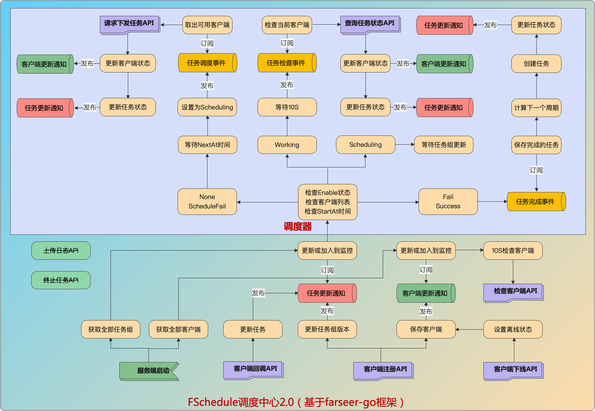

# FSchedule概述
分布式调度中心，支持几千个任务同时运行。任务调度控制在50ms以内。

在传统的本地任务执行，无法做到高可用、一致性。调度与任务执行在同一个进程中。

而在FSchedule中运行的是调度逻辑，到达时间节点时，会通知你的客户端进程执行任务。

它有分布式、高可用、解耦任务执行与调度逻辑、弹性伸缩、跨语言、一致性、数据分片执行、集群模式、广播模式、分布式日志等特性。

Server端以Docker方式运行（支持集群HA），JOB任务可通过官方提供的SDK快速集成到你的程序（客户端），接入到调度中心。

## 特性
1. [x] `动态任务组`：支持动态创建任务组，客户端上线时动态注册任务组。
2. [x] `服务端HA`：服务端支持集群部署，保证HA。
3. [x] `客户端HA`：客户端支持集群部署，保证所有任务的HA。
4. [x] `调度解耦`：服务端只部署一次，调度器与任务执行分离，调度器由服务端提供，任务的执行在客户端自行实现，相互之间没有耦合。
5. [x] `弹性伸缩`：客户端每次上下线时，调度器将重新计算分配任务。
6. [x] `少依赖`：服务端只依赖redis、数据库，不需要依赖zk、etcd。
7. `官方SDK`：官方提供go、c#客户端，可快速接入服务端。
8. [x] `跨语言支持`：提供了http协议，其它语言客户端可自行接入。
9. [x] `故障转移`：客户端异常退出后，进行中的任务将转移到可用的客户端节点，重新运行。
10. [x] `一致性`：集群模式保证只会调度一次到客户端。广播模式保证每个客户端只会运行一次。
11. [x] `自定义参数`：支持对任务组配置参数，客户端运行期间也可以动态更新参数。
12. `Docker支持`：官方提供Docker镜像部署。
13. [x] `高性能`：每个任务组将单独分配一个协程，并利用多个通道实时通知处理。 
14. [x] `任务版本号`：任务组有版本号属性，新版本号覆盖旧版本号。同时旧版本不再被调度。 
15. [x] `任务集群模式`：同一个任务执行将只调度到其中一个客户端执行。
16. `任务广播模式`：同一个任务将调度到所有可用的客户端上执行。
17. `数据分片`：任务可根据当前客户端数量自动分片到所有客户端，每个客户端只处理一部份数据，做到并行处理。
18. `任务依赖`：可以设置任务执行前、执行后时运行依赖的任务。
19. [x] `动态更新计划`：支持客户端更新下次执行计划时间。
20. [x] `分布式日志`：支持日志上传到集群，统一查看。
