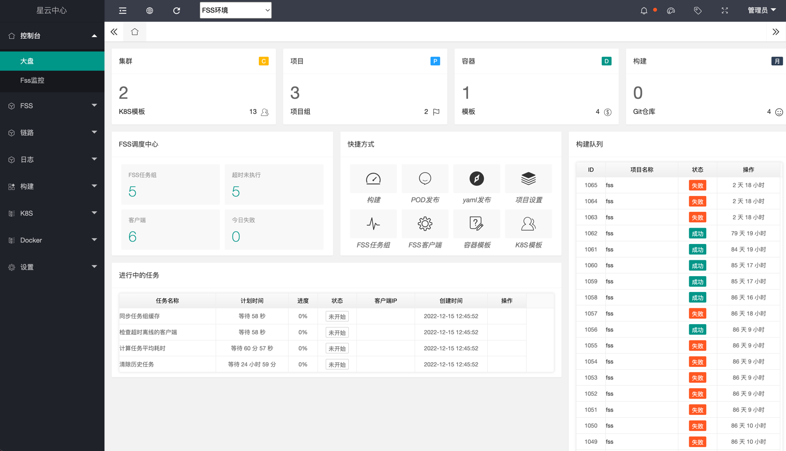
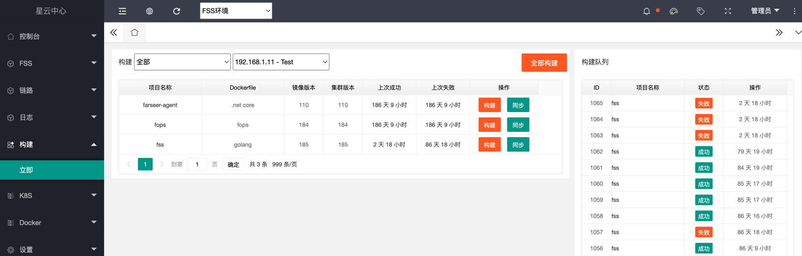
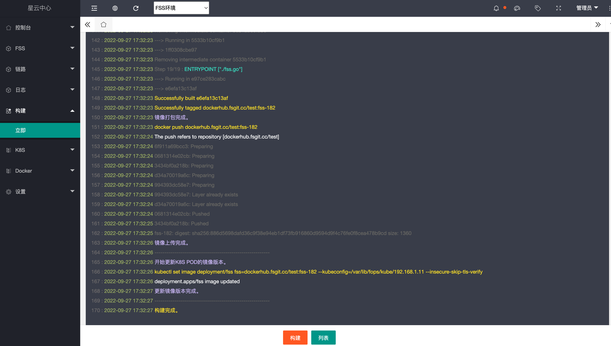

# 招募小伙伴一同参与开发《轻量级分布式平台》
计划重新开发一套`轻量级分布式平台`。支持一百台规模的`集群管理`，支持应用程序的`自动化发布`，以及`容器、镜像的管理`。 
用于在中小型项目中，可以代替K8S。

## 前身
前身有一个轻量级的应用程序自动化发布功能（`FOPS 1.0`）。已实现将应用程序通过`Git拉取`、`自动编译`、`打包成镜像`、`远程K8S发布`。

## 重新定位
我们团队计划重写新版本，之前的定位是一个jenkins + k8s的发布平台。 

新版本重写后的目标是：
* 支持一百台规模Linux集群的`分布式管理平台`。
* 使用`GRPC`通讯。
* 使用`Docker`作为容器操作（也可以考虑使用`containerd`)
* 使用`Traefik`作为应用负载
* 使用`GO语言`开发。
* 使用`farseer-go框架`编写基础设施组件部份。
* 使用`DDD`分层编码。
* 使用`Elasticsearch`为日志存储。
* 使用`Mysql`存储元数据。
* 使用`Etcd`实现应用服务的注册发现。
* 还在想.....
## 功能概述
* 服务器管理
  * 收集CPU使用量、内存使用量、硬盘、网络IO、磁盘IO
  * 支持预警设置及告警通知。
  * 支持远程关机、重启。
* 容器管理
  * 支持查询所有节点的镜像、容器列表
  * 支持对单个容器的创建、停止、删除、查看
  * 提供容器仓库
  * 支持Dockerfile模板
* 应用管理
  * 持续集成&持续交付
    * 每个步骤都是由独立的模块组工作
      * Git模块
      * 编译模块
      * 测试模块
      * 容器打包模块
      * 容器上传模块
      * 发布到集群模块
      * 发布到K8S模块
      * 构建结果通知模块（钉钉）
    * 通过模块组的方式定义构建流程
    * 支持自动/手动集成
    * 交付成功后，生成评审请求
  * 持续部署
    * 通过评审的版本，部署到生产环境
  * 支持发布到k8s
    * 支持k8s镜像管理
    * 支持yaml模板管理
  * 支持发布到集群
    * 支持DaemonSet模式
    * 支持根据服务器压力、实例数量，提供轻量级的服务编排
    * 支持应用程序的滚动升级
    * 提供应用的服务发现，实现流量的转发负载
    * 提供nfs服务，实现应用的分布试存储
  * 管理应用程序的运行、停止、删除
* 日志服务
  * 收集容器的日志
  * 提供容器日志的实时查看
  * 提供容器日志的历史查看
* 提供fss的管理功能
* 提供链路追踪数据查看
* 支持MQ队列管理
  * Rabbit
  * RedisStream
* 支持Redis管理
* 支持钉钉告警
* 等你来讨论...

## 何时开始
现阶段处于功能的定位、探索与讨论的过程中。我们希望招募过来小伙伴能全程参与进来，所以现阶段不急于编写代码部份。

《功能概述》提到的一系列要实现的功能，也将分布在不同的版本，逐渐迭代。

每次释放版本，我们都将对外发表相关的实现文章，以让更多的小伙伴共同学习。

本着负责任的态度，我将全职参与到这个项目中来。组员通过业余时间参与。

## 邀请您加入
现我们团队邀请社区人员加入我们一起共同开发这套开源项目。

为了提高项目的质量，我们希望您掌握一些内容：

* 有3年以上从事GO工作的小伙伴，或8年其它语言经验以上又想学习GO的小伙伴。
* 了解K8S或类似的分布式平台原理。
* 有容器的实际的使用经验。
* 有一定的linux基础，能自行搭建常用平台。
* 你必须非常热爱GO（如果可以的话每天投入1个小时）。

`如果你感兴趣想加入，请通过下方的钉钉扫描联系我们`
## 您将得到
* 您将有一款属于你自研的产品。
* 您将能学习到更多的分布式平台经验。
* 为开源社区贡献微薄的力量。
* 我们一群热爱讨论技术的小伙伴。

## 关于我们
我们是farseer-go框架团队。

farseer-go是基于Golang模块化完整的基础设施框架，创建现代化Web应用和APIs。

框架完美支持 DDD领域驱动 的战术设计，如仓储资源库、应用层事务、领域事件、应用层动态WebAPI。

- `farseer-go文档`
  - [English](https://farseer-go.gitee.io/#/en-us/)
  - [中文](https://farseer-go.gitee.io/)
  - [English](https://farseer-go.github.io/doc/#/en-us/)
- `源代码`
  - [github](https://github.com/farseer-go/fs)

