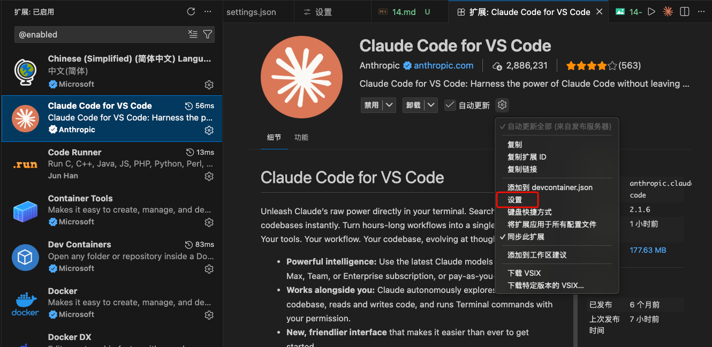
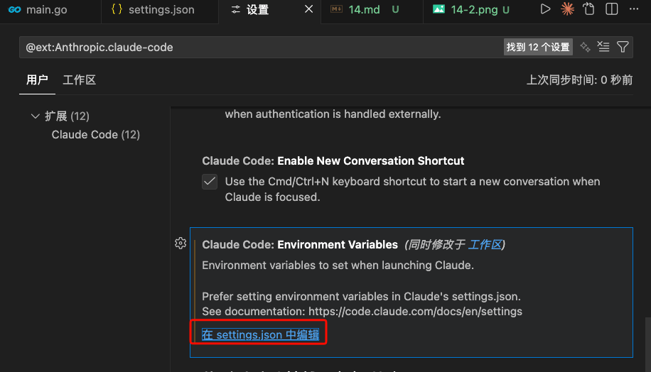

# Claude Code 使用Openrouter服务
> 参考：https://openrouter.ai/docs/guides/guides/claude-code-integration
## 1、安装Claude Code
Mac
```shell
curl -fsSL https://claude.ai/install.sh | bash
```
npm
```shell
npm install -g @anthropic-ai/claude-code
```

Windows
```shell
irm https://claude.ai/install.ps1 | iex
```

## 2、安装CCR
参考：https://github.com/musistudio/claude-code-router/blob/main/README_zh.md
```shell
npm install -g @musistudio/claude-code-router
```

## 3、配置CCR
```shell
cat <<EOF | sudo tee ~/.claude-code-router/config.json
{
  "LOG": false,
  "LOG_LEVEL": "debug",
  "CLAUDE_PATH": "",
  "HOST": "127.0.0.1",
  "PORT": 3456,
  "APIKEY": "",
  "API_TIMEOUT_MS": "600000",
  "PROXY_URL": "",
  "transformers": [],
  "Providers": [
    {
      "name": "openrouter",
      "api_base_url": "https://openrouter.ai/api/v1/chat/completions",
      "api_key": "$OPENROUTER_API_KEY",
      "models": [
        "anthropic/claude-sonnet-4.5",
        "anthropic/claude-haiku-4.5",
        "z-ai/glm-4.7",
        "deepseek/deepseek-r1"
      ],
      "transformer": {
        "use": [
          "openrouter"
        ]
      }
    }
  ],
  "StatusLine": {
    "enabled": false,
    "currentStyle": "default",
    "default": {
      "modules": []
    },
    "powerline": {
      "modules": []
    }
  },
  "Router": {
    "default": "openrouter,anthropic/claude-sonnet-4.5",
    "background": "openrouter,anthropic/claude-haiku-4.5",
    "think": "openrouter,deepseek/deepseek-r1",
    "longContext": "openrouter,z-ai/glm-4.7",
    "longContextThreshold": 60000,
    "webSearch": "openrouter,deepseek/deepseek-r1",
    "image": "openrouter,anthropic/claude-sonnet-4.5"
  },
  "CUSTOM_ROUTER_PATH": ""
}
EOF
```
> 注意：$OPENROUTER_API_KEY 需要到`openrouter.ai`中获取并替换

## 4、命令行中，使用openrouter服务
vim ~/.zshrc 文件中，写入：
```env
export ANTHROPIC_BASE_URL="http://127.0.0.1:3456" # 不使用ccr，则填：https://openrouter.ai/api
export ANTHROPIC_AUTH_TOKEN="test"                # 不使用ccr，则填：openrouter.ai提供的token
export ANTHROPIC_API_KEY=""                       # 必须为空
#export ANTHROPIC_MODEL="z-ai/glm-4.7" #默认模型   # 不使用ccr，则不要注释此行
export NO_PROXY="127.0.0.1"                       # 不使用ccr，则注释此行
export DISABLE_TELEMETRY="true"
export DISABLE_COST_WARNINGS="true"
export API_TIMEOUT_MS="600000"
unset CLAUDE_CODE_USE_BEDROCK
```
## 5、VSCode的Claude Code插件中，使用openrouter服务
### 5.1、创建配置
```shell
cat <<EOF | sudo tee ~/.claude/config.json
{
    "primaryApiKey":"openrouter"
}
EOF
```
### 5.2、插件设置
找到`Claude Code for VS Code`插件，点小齿轮，选择：设置。


找到`在setting.json`中编辑


> 在`在setting.json`编辑：
```json
    "claudeCode.environmentVariables": [
        {
            "name": "ANTHROPIC_BASE_URL",
            "value": "http://127.0.0.1:3456"    # 不使用ccr，则填：https://openrouter.ai/api
        },
        {
            "name": "ANTHROPIC_AUTH_TOKEN",
            "value": "test"                     # 不使用ccr，则填：openrouter.ai提供的token
        },
        {
            "name": "ANTHROPIC_API_KEY",        # 必须为空
            "value": ""
        }
    ],
    #"claudeCode.selectedModel": "z-ai/glm-4.7", # 不使用ccr，则不要注释此行
```
> 注意：$OPENROUTER_API_KEY 需要到`openrouter.ai`中获取并替换

## 6、重启，使配置生效
```shell
ccr restart
```

## 7、superpowers插件
地址：https://github.com/obra/superpowers

在claude code命令行下执行：
```shell
/plugin marketplace add obra/superpowers-marketplace
/plugin install superpowers@superpowers-marketplace
/help
```