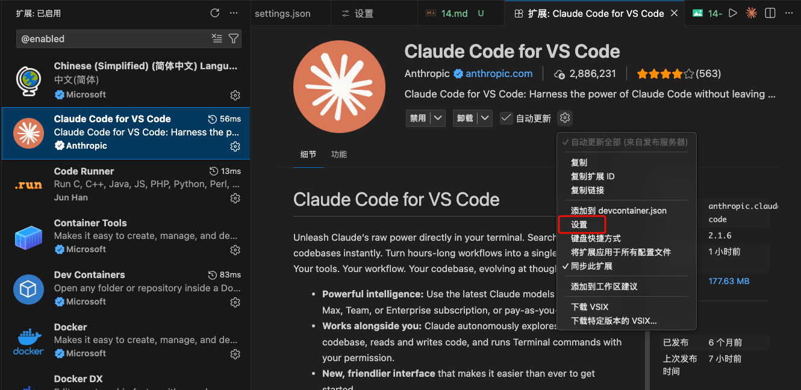
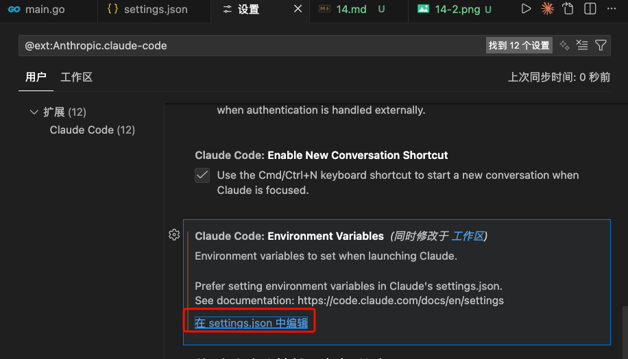

# ClaudeCode安装
> 参考：https://openrouter.ai/docs/guides/guides/claude-code-integration
## 1、安装Claude Code
Mac
```shell
curl -fsSL https://claude.ai/install.sh | bash
```
npm
```shell
npm install -g @anthropic-ai/claude-code
```

Windows
```shell
irm https://claude.ai/install.ps1 | iex
```

## 2、命令行中，使用openrouter服务
vim ~/.zshrc 文件中，写入：
```env
export ANTHROPIC_BASE_URL="订阅提供的API"
export ANTHROPIC_AUTH_TOKEN="订阅提供的token"
export ANTHROPIC_API_KEY=""                       # 必须为空
export ANTHROPIC_MODEL="z-ai/glm-4.7" #默认模型
export DISABLE_TELEMETRY="true"
export DISABLE_COST_WARNINGS="true"
export API_TIMEOUT_MS="600000"
unset CLAUDE_CODE_USE_BEDROCK
```

## 5、VSCode的Claude Code插件中，配置
### 5.1、创建配置
```shell
cat <<EOF | sudo tee ~/.claude/config.json
{
    "primaryApiKey":"openrouter"
}
EOF
```

### 5.2、插件设置
找到`Claude Code for VS Code`插件，点小齿轮，选择：设置。


找到`在setting.json`中编辑


> 在`在setting.json`编辑：
```json
    "claudeCode.environmentVariables": [
        {
            "name": "ANTHROPIC_BASE_URL",
            "value": "订阅提供的API"
        },
        {
            "name": "ANTHROPIC_AUTH_TOKEN",
            "value": "订阅提供的token"
        },
        {
            "name": "ANTHROPIC_API_KEY",        # 必须为空
            "value": ""
        }
    ],
    "claudeCode.selectedModel": "z-ai/glm-4.7",此行
```