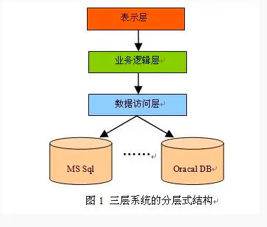
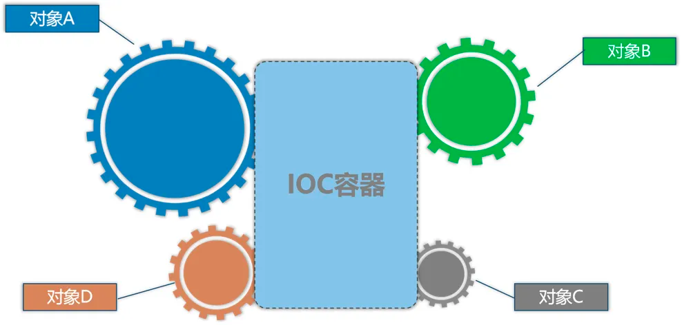

# 使用container解耦一
今天主要聊聊在我们的应用开发中，如何有效的实现代码上的解耦

解耦的目地是什么？简单来说，就是为了尽可能不依赖其它服务、逻辑或最少依赖。

如果说一个系统，修改了一处地方，使得下游的调用方也要跟着修改，或发布。那这就是强耦合了。

拿我们汽车来说，车胎被钉子扎破了，维修师傅要把你的方向盘给卸了才能补胎，你乐意吗？

之所以我们被称为"工程师"，而不是"写代码的"，就是因为我们所构建的代码是一个比较复杂、关联性比较强的一系列工程。

## 分层

我们为什么要在代码上分层？比如经典的三层架构、以及六边型架构、整洁架构（洋葱架构），就是为了降低耦合，实现单一职责、提高复用。

所以分层，已成为大家最基本的一个技能，即使再简单的项目，我们也会使用分层来达到解耦。



> 在一个简单的CURD项目中，我们或许不会过多考虑如何解耦，为了补胎而卸了方向盘，也认了。反正付出的成本不值一提。

有一点不得不说，为了解耦，我们是要付出一些代价的。因为我们的代码量上去了、需要更多的设计思维了。

## Interface
使用Interface，也是我们用于解耦的一个利器。

在23种设计模式中，本质是什么？就是利用interface来达到解耦而总结出的常用的模式。

大家或许听了很多：不要依赖具体的实现，而是依赖接口，我们应该面向接口编程。

此后出现了一个流派，为了解耦而解耦，即使在同一层（比如Logic层、DAL层），随处可见定义了interface然后对应一个实现类。

其实这种方式表面上是实现了"解耦"，但反而加重了我们写代码的负担。

简单点来说，接口是你定义的、实现也是你定义的。我作为下游调用你的逻辑，虽然用的是interface，但还是耦合了。

如果大家理解了我这句话，就应该明白：这样的解耦，只是看上去好像是解耦了，这种在同一层代码中的一对一的方式并没有太多的意义。

## IOC
interface是我们要实现解耦，而作为开发语言中使用到的一个语法而已。

IOC技术出现，则可以让我们更进一步的实现解耦的目地。



通过IOC，不再需要调用方来初始化这个对象。而是提供方，提前做好注册。

使用方拿来即用，不用考虑对象初始化，也就断开了这个初始化的强依赖。

换句话说，有了IOC技术的出现，使得我们真正意义上不用直接依赖具体的实现了

我们看下代码层而：

### 1、逻辑层
```go
package client
type Repository interface {
    // ToList 获取客户端列表
    ToList() collections.List[DomainObject]
}

// 取出全局客户端列表
func Get() collections.List[client.DomainObject] {
    repository := container.Resolve[Repository]()
    return repository.ToList()
}
```
`Repository`接口定义了`ToList()`函数，用于从某处取出数据。

`Get()`函数是下游(UI层)会来调用，拿到结果后，返回给前端。

`container.Resolve`是从IOC容器中取出实现了`Repository`接口的实现类
> 这里我们没有看到逻辑层会依赖DAL层。

### 2、数据访问层
```go
package repository

func RegisterClientRepository() {
	// 注册仓储
	container.Register(func() client.Repository {
		return &clientRepository{ }
	})
}

type clientRepository struct {
}

func (repository clientRepository) ToList() collections.List[client.DomainObject] {
    return .....
}
```

读取数据的操作，是在数据访问层。它实现了`Repository`接口

在传统的三层，我们一般是`逻辑层`依赖`数据访问层`，然后直接调用数据访问层提供的函数方法。

逻辑层负责通过IOC取出实现，至于实现的代码在哪里，逻辑层并不关心。因为逻辑层`只负责定义这个标准`。

数据访问层负责对这个接口的实现，数据访问层也不关心谁使用了这个实现。

### 3、UI层
```go
func main() {
    fs.Initialize[StartupModule]("fSchedule")

    webapi.RegisterPOST("/meta/GetClientList", client.ToList)
    webapi.UseCors()        // 使用CORS中间件
    webapi.UseApiResponse() // 让所有的返回值，包含在core.ApiResponse中
    webapi.PrintRoute()     // 打印所有路由信息到控制台
    webapi.UseApiDoc()      // 开启api doc文档
    webapi.UseValidate()    // 使用DTO验证
    webapi.UseStaticFiles() // 使用静态文件 在根目录./wwwroot中的文件
    webapi.Run()
}
```

事实上，我这里没有使用到UI层。利用[webapi](https://github.com/farseer-go/webapi)组件，可以做到动态api，直接指向逻辑层。

### 4、分析
首先，UI层依赖了逻辑层。（在main中直接调用了）

其次，逻辑层没有依赖数据访问层，而是定义了一个`Repository`接口

数据访问层，负责对`Repository`接口实现了数据操作，即可以是读数据库，也可以是读Redis。

可以看到，逻辑层不关心你的数据来源，只要你提供给我就好了。我的核心在于逻辑的处理。

相反，数据访问层依赖了逻辑层。没错，反转了。这就是：`依赖倒置原则`。

在数据访问层，还有一个方法：`RegisterClientRepository`，谁来调用这个注册？

这里使用到的是[farseer-go](https://github.com/farseer-go/fs)组件，利用模块化技术实现的模块初始化。

_数据访问层module.go_
```go
type Module struct {}
func (module Module) DependsModule() []modules.FarseerModule {
	return []modules.FarseerModule{data.Module{}, redis.Module{}, eventBus.Module{}, queue.Module{}, fSchedule.Module{}}
}
func (module Module) PreInitialize() {}
func (module Module) Initialize() {}
func (module Module) PostInitialize() {
	repository.RegisterClientRepository()
}
func (module Module) Shutdown() {}
```

`PostInitialize`方法，会在模块初始化阶段调用这个`RegisterClientRepository`函数。

在main中，我们调用了`fs.Initialize[StartupModule]("fSchedule")`，这会初始化框架，并加载所有模块。

在这里，我们的数据访问层做为一个模块module.go，被加载进去。

## 总结
在这里，我们给大家讲解了，如何使用IOC来达到依赖反转

假如原来数据访问层是读数据库数据的，出于性能优化考虑，得加上Redis缓存，这个时候逻辑层是完全不用动的。

不至于，换个轮胎把我方向盘给拆了。

代码演示中用到了几个组件技术：
- [farseer-go](https://github.com/farseer-go/fs) 这是一个模块化框架，内置了IOC容器组件。
- [webapi](https://github.com/farseer-go/webapi) web api服务 https://github.com/farseer-go/webapi
- [框架文档](https://farseer-go.github.io/doc/)
- [IOC文档](https://farseer-go.github.io/doc/#/basic/container) https://farseer-go.github.io/doc/#/basic/container

事实上，IOC只是解耦的其中一种方式。在实际项目中，我们会同时使用其它技术手段来达到这个目地。

出于篇幅的原因，我会在后面继续跟大家来分享其它解耦方式。

下一章，我会尽快推出。