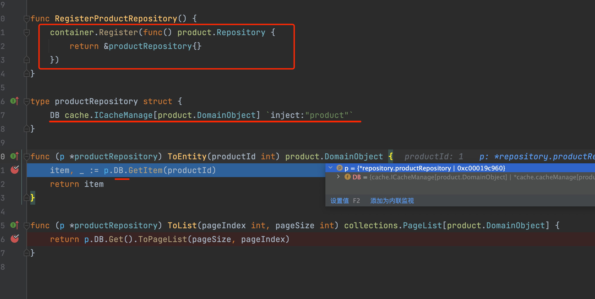

# 使用container解耦二
在上一篇中，主要是从分层的角度切入聊到IOC的使用介绍，不过上篇只主要是大概介绍了IOC中的注册实例与手动获取接口的实例。

这在实际的开发中，会显的比较累赘，虽然很好的实现了分层之后，层与层之间的解耦，但用起来并不顺手。

在这篇中，主要是讲解在实际应用中应该如何更优雅的使用IOC技术，即能达到分层的解耦，又能让代码看着更舒服。

## 注入
事实上在IOC中，我们很少会使用`container.Resolve[xxx]()`这种方式来获取实例，因为这样写代码没那么优雅。通常我们会使用注入的方式。

注入的方式又分为：
- 构造函数注入
- `方法入参`注入
- `属性`注入

在GO中，并没有构造函数注入（实际上是用函数的方式来模拟）。所以我们这里主要是讲解后两种。

### 方法入参注入
我们来看下这个代码示例

```go
    fs.Initialize[StartupModule]("demo")
    webapi.Area("/api/1.0/", func () {
        webapi.RegisterPOST("/product/ToEntity", productApp.ToEntity)
    })
    webapi.UseApiResponse()
    webapi.Run()
```

从上方的代码，我们注册了一个`productApp.ToEntity` 动态API。

```go
package productApp

import (
	"shopping/domain/products/product"
	"github.com/farseer-go/collections"
	"github.com/farseer-go/mapper"
)

// ToEntity 查看商品详细信息
// repository通过container自动注入实现进来
func ToEntity(productId int, repository product.Repository) DTO {
	do := repository.ToEntity(productId)
	dto := mapper.Single[DTO](do)
	return dto
}
```

ToEntity接收两个入参，int、product.Repository（接口）。当前端请求这个接口时，repository参数，会被自动注入：


此时，`repository`参数不需要我们手动去实例化或到container中获取。

当然你也可以手动获取来实现，只是没必要：
```go
func ToEntity(productId int) DTO {
    repository := container.Resolve[product.Repository]()  // 手动获取
	do := repository.ToEntity(productId)
	dto := mapper.Single[DTO](do)
	return dto
}
```
这是不使用注入，而手动获取的方式。该种方式显的麻烦。

## 属性注入
接下来我们看下`product.Repository`的实现：


在这个代码示例中，`productRepository`结构体中包含了：`DB`字段，并设置标签：`inject:"product"`

同时`RegisterProductRepository`函数会执行注册这个实现到`product.Repository`接口中。

DB字段，是通过自动注入拿到实现的。

标签：`inject:"product"`是告诉container，要如何解析这个接口字段。product是别名：

```go
container.Register[cache.ICacheManage[product.DomainObject]](..., "product")
```

在注册时，设置了别名：product

## 什么时候这个属性会被注入？

如果当前这个结构体是通过container容器取出来的，就会去查找这个对象（结构体）字段中，是否有接口类型的字段，并且是已注册到container中的。就会启用属性注入。

完整的代码示例，可以到[这里查看](https://github.com/farseer-go/demo/blob/main/shopping/main.go)

## 总结
通过这两篇文章的讲解，我们知道了可以使用IOC的技术来为分层进行一个解耦操作，特别是提到的"依赖倒置"原则，让我们的数据访问层不再由逻辑层依赖，面是反过来依赖逻辑层。

这有什么用呢？如果让逻辑层依赖数据访问层，会让我们的逻辑层变的不利于单元测试，并且数据访问层的任何变动，都会影响到逻辑层。

因为我依赖你，你的代码变动了，我也要跟着重新测试。（当然整体的集成测试免不了）我只是说尽可能的减少影响范围。

事实上IOC技术在.NET、JAVA中都是非常基础且常用的技术，但在GO中似乎用的少。但作者对于项目的编码一般都是使用DDD软件思维方式。 所以依赖倒置是必须做到的。

所以我在刚接触GO时，第一件事情就是去找在IOC组件，只是没找到比较满意的组件，最后不得已自己实现。

然而IOC技术只是解耦用到的其中一个组件，其它技术的使用，将在后面继续推出，尽情期待。

文章中使用到的组件：

代码演示中用到了几个组件技术：
- [farseer-go](https://github.com/farseer-go/fs) 这是一个模块化框架，内置了IOC容器组件。
- [webapi](https://github.com/farseer-go/webapi) web api服务 https://github.com/farseer-go/webapi
- [框架文档](https://farseer-go.gitee.io/)
- [IOC文档](https://farseer-go.gitee.io/#/basic/container) https://farseer-go.gitee.io/#/basic/container