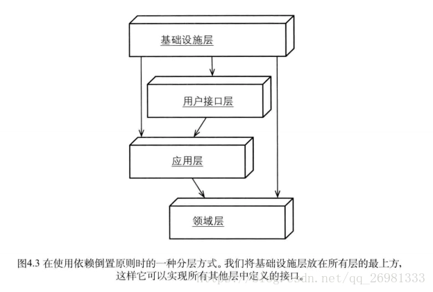
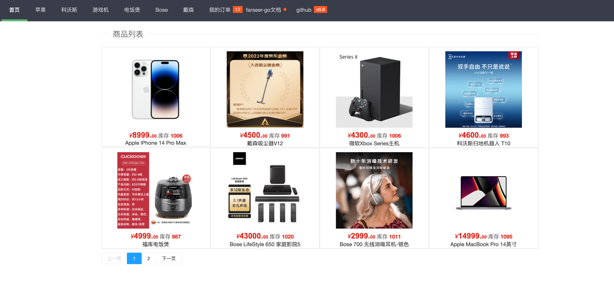
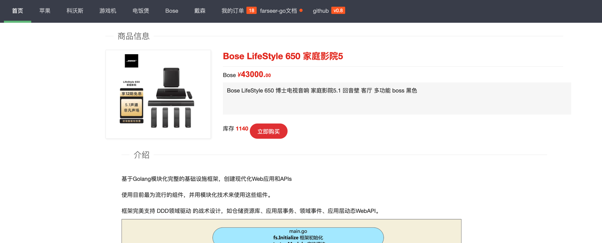
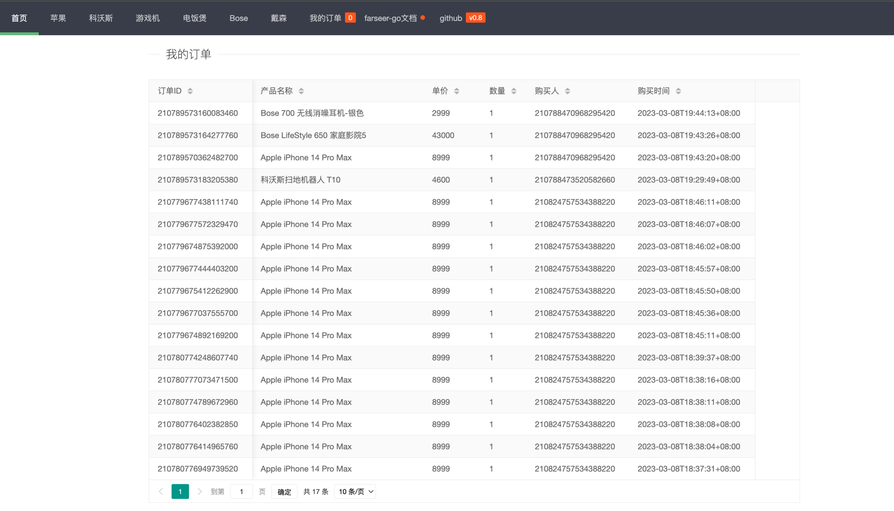
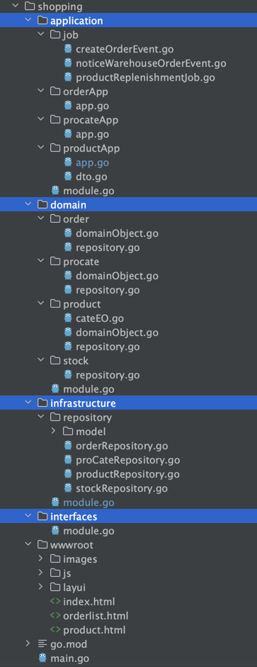
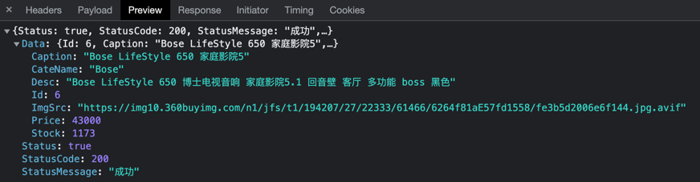
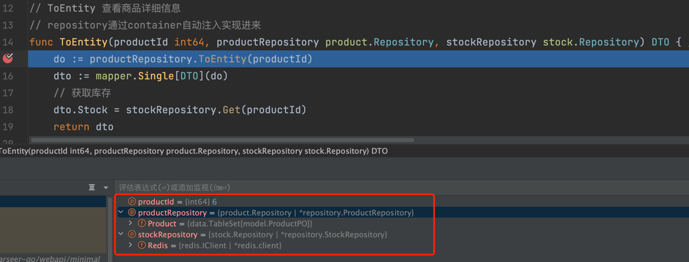
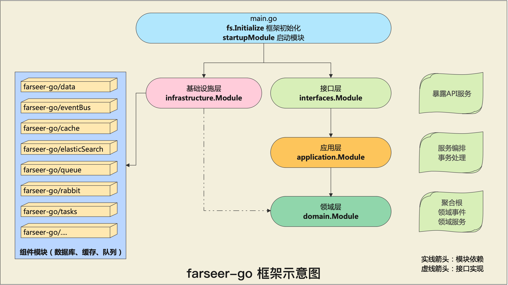

# 用真实的项目带你搞懂领域驱动设计
## 1、前言
从学习编程语言以来，我们会花大量时间去研究编程语言中比较流行的框架，但我们很少花时间从软件设计的角度去切入学习。

大部份的项目中，一般都会采用经典的三层模式：`UI层`->`逻辑层`->`数据访问层`。

之所以三层模式足够流行，是因为它足够简单，就像与生俱来天生就会的技能一样。

当你接触项目越来越多、越来越复杂，不再是每张表的CURD的时候，这时你应该会在想：

- 这种软件工程难道没有一种更科学的、更有设计味道、更有思想高度的一种架构模式吗？
- UI层收到请求通知，然后一直到逻辑层，再到数据访问层，是否还有其它的模式？
- 贫血模式带来的失忆症该怎么解决？
- 一张表对象(PO)到处有赋值行为，时间一久我都忘了当初为什么要对这个字段赋值？
- A表依赖B表的数据，这种逻辑我到底放A逻辑层还是B逻辑层？再加一层？规则层？外观层？
- 需求一来，想好实现方式，紧接着直接建表？
- 100多张表了，这项目越来越乱了，是我表设计的不好？还是根本就没设计？
- 为什么加一个需求，我改了几十处的代码，原来没问题的代码都被我改出BUG了。
- 每次重构之后，我都觉得自己特牛逼。过个1年，又来重构，美约1.0、2.0、3.0？

如果您跟我一样有这些共鸣，那么希望这篇文章能给你带个启发。

## 2、什么是领域驱动设计
网上已经有非常多关于领域驱动的一些概念讲解了，本篇的目的在于用`实际项目代码`来让小伙伴们快速认识领域驱动设计。

不管怎么说，我先把这些名词列出来，方便后面我们共同深入探讨。

### 2.1、领域驱动设计中的四层

### 2.2、基础设施层
这一层，狭义的可以理解为是三层的数据访问层，这么定义是方便大家理解与三层的对比。

随着我们的项目的复杂度越来越高，除了依赖数据库，还会依赖缓存，http，rpc，mq，es等等。

在`传统的三层`，我们大部份会在`逻辑层直接依赖中间件、协议`。

但是你发现了吗，依赖的技术中间件只是为了解决海量数据、高并发、性能，跟业务逻辑其实一点关系都没有。

哪天mongodb换成es、ch，难道我们还要在逻辑层也跟着改吗？（哪怕是一个字符也是改）

所以，涉及到`非业务逻辑`、`非技术需求`，`技术类`、`协议类`，都应该放到基础设施层。

并且`与传统三层`有一个很大的`区别`，逻辑层（`领域层`）是`不能直接依赖基础设施层`。（依赖倒置，`通过依赖领域层的仓储接口`）

### 2.3、领域层
我们项目中的`逻辑`、以及`行为`（动作）会产生`不同的属性`时，都在`领域层实现`。

领域层是充血模型，即带有行为的实体对象。

领域层通常会包含：`限界上下文`、`聚合`（聚合根、实体对象、值对象）、`仓储接口`、`领域事件`、`领域服务`

`仓储接口`是用来定义一些`数据访问`的`interface`。由`基础设施层来实现`。

本篇不是领域驱动设计的概念讲解，这里只是告诉大家有哪些概念，如果想深入学习的，网上有很多这方面的讲解。

### 2.4、应用层
可以理解为，在传统三层中的UI层与逻辑层之间多了一层。

`应用层`的用途是为了将领域层做`逻辑编排`、与`事务控制`（如数据库事务），没有实战过的小伙伴，这里有可能会比较难理解。

很多时候无法区分应用层与领域层的职责。总之，业务逻辑、对象的属性实际赋值，放在领域层。而比如一个请求要做3个逻辑处理。那么这个1、2、3先后顺序的控制，由应用层组织编排。

像数据库事务也是由应用层来控制，为什么这么做？因为`领域层``不能`间接或直接`依赖基础设施层`的。

> 思考时间：通过这句话，大家是否有进一步的思考，为什么领域层不能间接或直接依赖基础设施层呢？欢迎评论区讨论。

### 2.5、接口层
这一层就可以理解为在三层里的UI层了。通常像我们做的API涉及到的MVC，就是放到了这一层。

由于`farseer-go`框架的`webapi`支持`动态api`技术，是一种`无代码入侵`的技术实现。因此在后面的demo中，你会看到我们的接口层是没有代码的。

在api路由配置中，直接指向了应用层，这也是可以的。这样可以让我们少一层的转发，代码也更加容易维护。

### 2.6、战略设计
在这个小章节，我给大家简略的讲述了领域驱动设计的分层概念，但我怕误导大家，因为领域驱动设计是分为两个部份的：`战略设计`、`战术设计`。

事实上涉及到编码部份（包括上面提到的分层）都是战术部份。`领域驱动设计最难的是战略部份`。

那什么是战略设计呢？如果比喻成一个武功，`心法就是战略设计`、`招式则是战术设计`。

因此也可以知道`心法`（战略设计）是有多么的`重要`。`战略设计`可以让我们`知道`在一个项目中`如何划分限界上下文`、`如何划分聚合`，做整体的一个设计。

我们经常听到的微服务，你是否有想过一个问题：这个服务该怎么划分？微服务决非是RPC + 小接口，如果是这么理解，就大错特错了。

在这里突然说到微服务，是因为`微服务`在划分服务与服务之间的界限时，正好`可以完全使用到领域驱动设计中的限界上下文的设计方法来划分`的。

因此领域驱动是每一个做互联网、写服务API的开发人员都要学习的，哪怕你不用，起码也要懂其中的原理。

> 感谢你能坚持看到这，如果对你有用，请给个不要钱的小爱心，让作者的爱继续发扬光大。
> 
> 有了前面的铺垫，接下来，我们马上进入代码部份。

## 3、实战项目
> 使用到的框架：[farseer-go](https://github.com/farseer-go/fs) 如果可以的话，请大家给farseer-go 1个star
> 
> 项目开源代码：[github](https://github.com/farseer-go/demo)
> 
> 框架官方文档：[文档](https://farseer-go.gitee.io/)

## 3.1、小型电商平台

这是模拟了一个小型电商平台，用到的技术：
* ddd：使用领域驱动设计
* ioc：使用ioc/container，做解耦、注入、依赖倒置
* webapi：api服务，并使用动态api技术
* data：数据库操作
* redis：redis操作
* eventBus：事件驱动

### 3.1.1、首页截图

按商品分类，浏览商品

### 3.1.2、商品详情页

商品详情，下单

### 3.1.3、订单列表页

下订单后，通过事件驱动来通知商品减库存、保存订单数据

## 3.2、数据库表

* ProductPO：商品，表名：`farseer_go_product` （技术点：实现了数据库的插入、查找、分页技术）
* ProCatePO：商品分类，表名：`farseer_go_procate` （技术点：与Redis缓存自动同步，redis没数据时自动从数据库读取并缓存到redis）
* OrderPO：订单信息，表名：`farseer_go_order` （技术点：利用事件驱动，解耦下单时，商品、订单的耦合）

## 3.3、Redis缓存
* 库存：key：`farseer_go_stock` （保存商品的库存，这里不考虑库存并发等问题，只演示如何使用Redis模块）
* 商品分类：key：`procate` （数据库表`farseer_go_procate`与Redis同步）

## 4、代码讲解


## 4.1、注册路由
**文件位置：shopping/main.go**
```go
func main() {
	fs.Initialize[StartupModule]("demo")

	// 让所有api带前缀："/api/1.0/"
	webapi.Area("/api/1.0/", func() {
		// 商品分类列表
		// get http://localhost:8888/api/1.0/cate/list
		webapi.RegisterGET("/cate/list", procateApp.ToList)
		// 购买商品
		// get http://localhost:8888/api/1.0/product/buy
		webapi.RegisterPOST("/product/buy", productApp.Buy)
		// 商品信息
		// get http://localhost:8888/api/1.0/product/info?productId=1
		webapi.RegisterGET("/product/info", productApp.ToEntity)
		// 商品列表
		// get http://localhost:8888/api/1.0/product/list?pageIndex=1&pageSize=3&cateId=0
		webapi.RegisterGET("/product/list", productApp.ToList, "cateId", "pageSize", "pageIndex", "", "")
		// 订单列表
		// get http://localhost:8888/api/1.0/order/list?pageIndex=1&pageSize=3
		webapi.RegisterGET("/order/list", orderApp.ToList, "pageSize", "pageIndex", "")
		// 订单数量
		// get http://localhost:8888/api/1.0/order/count
		webapi.RegisterGET("/order/count", orderApp.Count)
	})
    webapi.UseCors()        // 使用CORS中间件
    webapi.UseApiResponse() // 让所有的返回值，包含在core.ApiResponse中
    webapi.PrintRoute()     // 打印所有路由信息到控制台
    webapi.UseApiDoc()      // 开启api doc文档
    webapi.UseValidate()    // 使用DTO验证
    webapi.UseStaticFiles() // 使用静态文件 在根目录./wwwroot中的文件
	// 运行web服务，端口配置在：farseer.yaml Webapi.Url 配置节点
	webapi.Run()
}
```
首先，我们通过`fs.Initialize`函数引导farseer-go框架启动。

接着，我们注册了6个api接口

`webapi.UseApiResponse()`让我们的接口返回值时，自动包裹API的状态码相关字段。


`webapi.UseStaticFiles()`让我们支持静态目录`./wwwroot`来支持前端静态页面（这里是前后端分离）

注意看路由部份，依赖了`productApp`、`procateApp`、`orderApp`3个包。他们分别指：商品应用服务、产品分类应用服务、订单应用服务。

这些路由，是直接指向到应用层。因为webapi模块支持动态api模式，这样我们不再需要mvc模式的controller方式。

productApp.ToList、orderApp.ToList这两个路由指定了参数名称，这是因为当入参超过1个时，需要显示的申明第1个参数名称，第2个参数名称，以此类推。

## 4.2、应用服务层
接着我们看一下`productApp.ToEntity`这个服务。这是获取商品详情的信息。

**文件位置：shopping/application/productApp/app.go**
```go
// ToEntity 查看商品详细信息
// repository通过container自动注入实现进来
func ToEntity(productId int64, productRepository product.Repository, stockRepository stock.Repository) DTO { //
	do := productRepository.ToEntity(productId)
	dto := mapper.Single[DTO](do)
	// 获取库存
	dto.Stock = stockRepository.Get(productId)
	return dto
}
```
有3个入参：`productId`、`productRepository`、`stockRepository`。

通过路由注册，我们知道请求的URL是：GET http://localhost:8888/api/1.0/product/info?productId=1 ，1是商品的ID值

`productId参数`我们可以从URL中看出来，那么后面两个参数是怎么来的呢？

先看下productRepository的定义：

**文件位置：shopping/domain/product/repository.go**
```go
package product
import "github.com/farseer-go/collections"
// Repository 商品仓储
type Repository interface {
	// ToEntity 查看商品详细信息
	ToEntity(productId int64) DomainObject
	// ToPageList 获取商品列表
	ToPageList(cateId, pageSize, pageIndex int) collections.PageList[DomainObject]
	// ToList 获取所有商品
	ToList() collections.List[DomainObject]
	// Count 获取数量
	Count() int64
	// Add 添加商品
	Add(product DomainObject)
}
```
从文件位置上，可以看的出来，这是放在domain（领域层）的，并且是属于product目录。

也就是说，这是放在产品领域的。而`Repository`是仓储的意思，其类型是`interface`，从定义的方法可以看出来，是针对数据库的。

这与传统的三层模式不一样。在领域驱动设计里多出这么一个接口定义。

> 思考时间：为什么要这么定义？是不是多余的？欢迎评论区讨论。

既然是有接口定义，那么就一定有实现，接下来，我们先不继续探讨应用服务层，而是先把这个仓储接口的实现给搞明白。

## 4.3、基础设施层的仓储实现

**文件位置：shopping/infrastructure/repository/model/productPO.go**
```go
package model
type ProductPO struct {
	Id       int64   `gorm:"primaryKey;autoIncrement;comment:商品ID"`
	CateId   int     `gorm:"type:int;not null;index:idx_cateId;comment:商品分类ID"`
	CateName string  `gorm:"size:32;not null;comment:商品分类名称"`
	Caption  string  `gorm:"size:32;not null;comment:商品名称"`
	Desc     string  `gorm:"size:512;not null;comment:商品描述"`
	ImgSrc   string  `gorm:"size:256;not null;comment:商品图片"`
	Price    float32 `gorm:"size:10;not null;index:idx_price;comment:价格"`
}
```
这是大家都熟悉的配方：数据库表的实体类

**文件位置：shopping/infrastructure/repository/productRepository.go**
```go
type ProductRepository struct {
	// 定义数据库表映射TableSet
	Product data.TableSet[model.ProductPO] `data:"name=farseer_go_product"`
}

func (p *ProductRepository) ToEntity(productId int64) product.DomainObject {
	po := p.Product.Where("id", productId).ToEntity()
	// po 转 do
	return mapper.Single[product.DomainObject](&po)
}

func (p *ProductRepository) Count() int64 {
    ...
}
func (p *ProductRepository) ToPageList(cateId, pageSize, pageIndex int) collections.PageList[product.DomainObject] {
    ...
}
func (p *ProductRepository) ToList() collections.List[product.DomainObject] {
    ...
}
func (p *ProductRepository) Add(product product.DomainObject) {
    ...
}
```
就是一个普通的数据库操作，其完全实现了`product.Repository`接口。

大家还记得前面，第1个参数，我们知道是前端通过URL请求传过来的。那么第2个、第3个接口参数，是怎么赋值的呢？

图中可以看到，他们都是已经被赋值了。这其实就是ioc/container的`注入`功能了。

可以让我们少写很多代码，不需要手动到基础设施层的仓储实现来手动初始化了，是不是很方便。

这是怎么做到的呢？

## 4.4、仓储接口的注入

首先，在基础设施层先将`ProductRepository`实个结构体注册到`ioc/container`。

**文件位置：shopping/infrastructure/module.go**
```go
type Module struct { }

func (module Module) DependsModule() []modules.FarseerModule {
	// 使用到了redis模块、data(orm)模块、eventBus（事件总线）模块、queue（本地队列）模块
	// 这些模块都是farseer-go内置的模块
	return []modules.FarseerModule{redis.Module{}, data.Module{}, eventBus.Module{}, queue.Module{}}
}

func (module Module) PostInitialize() {
    // 初始化商品分类仓储
    repository.InitProCate()
    // 初始化商品仓储
    repository.InitProduct()
    // 初始化商品仓储
    repository.InitStock()
    // 初始化订单仓储
    repository.InitOrder()
}	
```
在Module模块的PostInitialize方法中，执行了`repository.InitProduct()`

```go
package repository
// InitProduct 注册商品仓储 ioc product.Repository
func InitProduct() {
	container.RegisterTransient(func() product.Repository {
		// 初始化数据库上下文
		// default = farseer.yaml > Database.default
		// true = autoCreateTable
		return data.NewContext[ProductRepository]("default", true)
	})
}
```
接着，执行了`container.RegisterTransient`，这是将`ProductRepository`实现类注册到`ioc/container`。

这里的注册，意思是将当前初始化`product.Repository`接口的方式交给ioc来管理其生命周期。

关于farseer-go的`ioc/container`使用，可以看[IOC](https://juejin.cn/post/7178771091555352634)、[container注入](https://juejin.cn/post/7180425706705256503)

当webapi发现请求的路由handle发现参数是接口类型（上面提到的第二个参数、第三个参数）时，就会尝试到`ioc/container`去解析是否有其实现。

如果找到了，则执行注入。现在我们就能理解，ToEntity的入参赋值是怎么回事了。

## 4.5、DomainObject聚合根

**文件位置：shopping/application/productApp/app.go**
```go
// ToEntity 查看商品详细信息
// repository通过container自动注入实现进来
func ToEntity(productId int64, productRepository product.Repository, stockRepository stock.Repository) DTO { //
	do := productRepository.ToEntity(productId)
	dto := mapper.Single[DTO](do)
	// 获取库存
	dto.Stock = stockRepository.Get(productId)
	return dto
}
```
我们继续看：`mapper.Single[DTO](do)`，这是将一个类型转成另一个类型的工具，比如PO转DTO。（代码这里是聚合转成DTO）

`productRepository.ToEntity`这个方法，返回的是`product.DomainObject`类型，并不是表实现类：`model.ProductPO`

虽然他们长的很像，但还是有区别的。我们知道数据库的字段，通常是扁平化的，也就是说字段都是展开来的。除非我们用JSON来保存，但这样对where条件不友好，且失去语义。

先来看一下`product.DomainObject`类型

**文件位置：shopping/domain/product/domainObject.go**

```go
package product
// DomainObject 商品
type DomainObject struct {
	Id      int64   // 商品ID
	Cate    CateEO  // 商品分类
	Stock   int     // 库存
	Caption string  // 商品名称
	Desc    string  // 商品描述
	ImgSrc  string  // 商品图片
	Price   float32 // 价格
}
// CateEO 商品分类
type CateEO struct {
	Id   int    // 商品分类ID
	Name string // 商品分类名称
}
```

我们再对比一下数据库表实体：`model.ProductPO`

**文件位置：shopping/infrastructure/repository/model/productPO.go**
```go
package model
type ProductPO struct {
	Id       int64   `gorm:"primaryKey;autoIncrement;comment:商品ID"`
	CateId   int     `gorm:"type:int;not null;index:idx_cateId;comment:商品分类ID"`
	CateName string  `gorm:"size:32;not null;comment:商品分类名称"`
	Caption  string  `gorm:"size:32;not null;comment:商品名称"`
	Desc     string  `gorm:"size:512;not null;comment:商品描述"`
	ImgSrc   string  `gorm:"size:256;not null;comment:商品图片"`
	Price    float32 `gorm:"size:10;not null;index:idx_price;comment:价格"`
}
```

发现没有，他们长的很像，区别在哪呢？是不是DomainObject（聚合）更加OOP？并且还多了个Stock字段。

> 小黑板：事实上，如果我们用领域驱动设计来设计项目代码时，一般是不会直接去建表的，而是先考虑这个聚合根长什么样。（当前会先划分限界上下文、领域事件等）
> 
> 我们不要被数据库表的数据如何存储，而失去了项目中原本最重要的业务逻辑的思考。
> 
> 如果改成这样的思考方式，我们是不是显的更加有设计感，而不再是表的CURD了？

由于这个项目，我演示的比较简单，也因此导致一个问题，所有的DomainObject没有行为产生。

如果想研究更复杂的`DomainObject`，大家可以去看我的一个`分布式调度中心2.0` [开源项目](https://github.com/FSchedule/FSchedule)。

如果可以，请给这个开源项目一个star。毕竟开源不易，作者都是用爱再发电，谢谢大家。

## 4.6、领域事件
什么是领域事件？简单来说就是某一类的动作会产生不同的事件。

在这里用户下单就是一个领域事件，比如当用户下单时，需要做：
* 减库存
* 创建订单
* 通知仓库人员准备发货

**文件位置：shopping/application/productApp/app.go**

```go
package productApp
// Buy 购买商品
// productRepository：商品仓储，webapi自动注入实例
// stockRepository：库存仓储，webapi自动注入实例
// webapi注入请参考：https://farseer-go.gitee.io/#/web/webapi/container
func Buy(productId int64, productRepository product.Repository, stockRepository stock.Repository) {
	// 减库存，剩余库存>0 ，扣减成功
	stockVal := stockRepository.Set(productId, -1)
	if stockVal > -1 {
		// 把商品信息查出来
		productDO := productRepository.ToEntity(productId)
		// 发布下单事件
		buyOrderEvent := container.Resolve[core.IEvent]("buyOrder")
		_ = buyOrderEvent.Publish(&productDO)
	}
}
```
通常，我们先减库存，因为我们要防止超卖，无法在异步环节处理。

> 在实际项目中，一般会提前生成OrderId，我在这里没做。

在最后两行，我们通过ioc/container容器，取出`core.IEvent`的实现。

然后调用事件发布：`buyOrderEvent.Publish(&productDO)`

先来看下这个`core.IEvent`的注册：

**文件位置：shopping/application/module.go**
```go
package application

type Module struct {
}

func (module Module) PostInitialize() {
	// 注册下单事件
	eventBus.RegisterEvent("buyOrder", job.CreateOrderEvent, job.NoticeWarehouseOrderEvent)
}
```
`eventBus.RegisterEvent`是注册事件的意思，事件名称：`buyOrder`，同时有两个事件订阅者：`CreateOrderEvent`、`NoticeWarehouseOrderEvent`

* `CreateOrderEvent`：创建订单（生成一条订单记录）
* `NoticeWarehouseOrderEvent`：通知仓库管理人员，需要准备打包货物（当然这里只是一个模拟）

这里的事件从技术角度来说，就是有一个发起方，有多个订阅者。（发布订阅模式）

随着业务的扩展，我们会不断的增加新的订阅者。保证新的需求过来时，不用修改原来的逻辑代码。

**文件位置：shopping/application/job/createOrderEvent.go**

```go
package job
import (
	"github.com/farseer-go/fs"
	"github.com/farseer-go/fs/container"
	"github.com/farseer-go/fs/core"
	"github.com/farseer-go/fs/snowflake"
	"shopping/domain/order"
	"shopping/domain/product"
	"time"
)
// CreateOrderEvent 订阅下单事件：创建订单
func CreateOrderEvent(message any, ea core.EventArgs) {
	productDO := message.(*product.DomainObject)
	orderRepository := container.Resolve[order.Repository]()
	orderRepository.Add(order.DomainObject{
		Id:             snowflake.GenerateId(),
		ProductId:      productDO.Id,
		ProductCaption: productDO.Caption,
		ProductImgSrc:  productDO.ImgSrc,
		ProductPrice:   productDO.Price,
		ProductCount:   1,
		CreateAt:       time.Now(),
		CreateId:       core.AppId,
	})
}
```

**文件位置：shopping/application/job/noticeWarehouseOrderEvent.go**

```go
package job
import (
	"github.com/farseer-go/fs/core"
	"github.com/farseer-go/fs/flog"
	"shopping/domain/product"
)
// NoticeWarehouseOrderEvent 订阅下单事件：通知仓库
func NoticeWarehouseOrderEvent(message any, ea core.EventArgs) {
	productDO := message.(*product.DomainObject)
	// 这里只是一个模拟，为了演示事件驱动的使用场景
	// 一个下单事件，可以订阅多个消费者
	flog.Infof("通知仓库打包商品：%d %s ￥%s元 1件", productDO.Id, productDO.Caption, flog.Red(productDO.Price))
}
```

## 5、各层流程
到了这里，代码部份已经分析完了，我们再做一个闭环，给大家一个完整的数据流向：

1. 在main.go中注册路由
2. api请求时根据路由，会执行应用服务层的服务。
3. 应用服务会请求领域层的仓储接口、或聚合根、领域事件。

通过分析也可以看出：
* 接口层、应用层、领域层没有依赖基础设施层
* 基础设施层是在main的启动模块(StartupModule.go)依赖的。
* 当领域层不依赖基础设施层，那么使用哪种OLTP、OLAP、缓存、mq都不会导致逻辑改变。
* 一个请求需要执行多个小逻辑时，由应用层控制（编排）

好了，本篇到这里就结束了。

> 感谢你能坚持看到这，如果对你有用，请给个不要钱的小爱心
> 
> 如果遇到有不明白的地方，欢迎留言提问。

> 使用到的框架：[farseer-go](https://github.com/farseer-go/fs) 如果可以的话，请大家给farseer-go 1个star
>
> DEMO项目开源代码：[github](https://github.com/farseer-go/demo)
>
> 框架官方文档：[文档](https://farseer-go.gitee.io/)
> 
> `分布式调度中心2.0` [github](https://github.com/FSchedule/FSchedule)。

如果这个DEMO您看完后，能完全掌握了，不防看下`分布式调度中心2.0`

