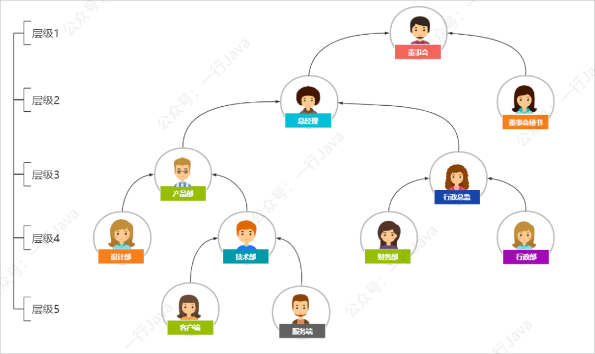
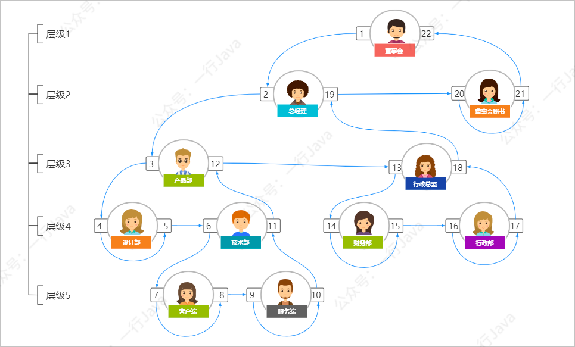
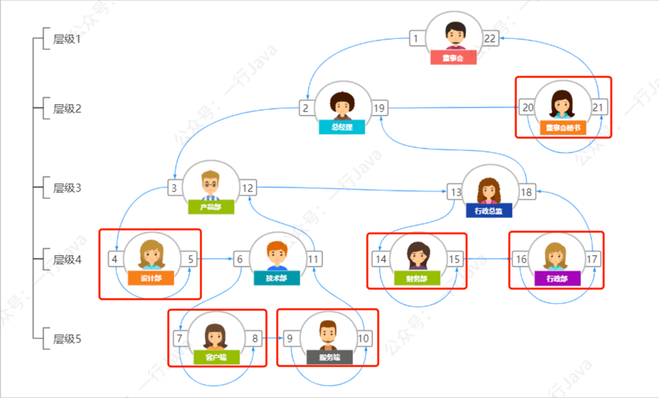
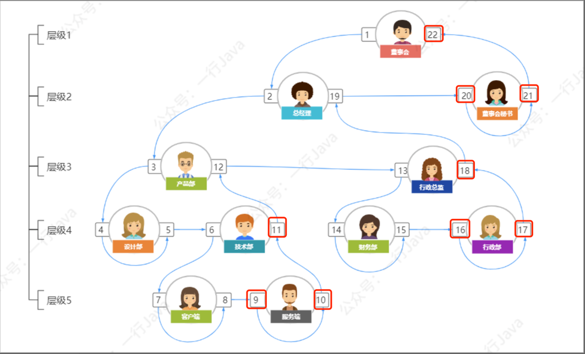

# 树遍历代替递归
用传统的递归，不仅SQL难以编写，且代码的实现也会比较丑陋

通常我们需要给表增加两个冗余字段：`parent_id`,`parent_ids`，分别代表上级ID，和所有上级的ID列表，以及主键`id`

假设id=100的记录如下：

| id  | parent_id | parent_ids |
|-----|-----------|------------|
| 100 | 50        | 50,10,2    |

然后在查询时使用：
```sql
# id=100 的直接下级数据
select * from tableName where parent_id = 100;


# id=100 的所有下级数据（很可惜FIND_IN_SET无法走索引）
select * from tableName where FIND_IN_SET(100,parent_ids);
# or like方式就需要parent_ids存的时候，前后要加,,
select * from tableName where parent_ids like '%,100,%';


# id=100 的上级数据，需要先取到id=100的parent_id，为50
select * from tableName where id = (select parent_id from tableName where id = 100);


# id=100 的所有上级数据
select parent_ids from tableName where id = 100;
select * from tableName where id in (50,10,2);
```

这里最严重的问题是`FIND_IN_SET`和`like`都无法走索引。

?> 事实上我们这种上下级关系的数据。我们可以从线性思维改变成一种树结构的思维

将这种有上下级关系的数据转换成树后，可以很好地解决我们遇到的问题，也让我们的代码更加地优雅。


我们知道树的遍历有三种：前序、中序、后序。（软考：软件设计师的考点）
* 前序遍历：`根左右`的顺序遍历
* 中序遍历：`左根右`的顺序遍历
* 后序遍历：`左右根`的顺序遍历

在这里我们可以使用`根左右`的顺序，也就是前序遍历，来给树节点设置一个顺序号。



这里我依然使用了`parent_id`，而在有些方案中，使用level层级来代替。在我实际使用中，觉得`parent_id`更方便些。

然后给每个记录增加两个字段：`lft`、`rgt`，分别代表左值、右值。

## 当前节点是否有子节点？

只需要rgt - lft == 1，也就是左右节点值相差1，便没有子节点。

比如上面的：设计部、客户端、服务端、财务部、行政部都是叶子节点

## 改进后的sql
技术部的字段值如下

| id | name | parent_id | lft | rgt |
|----|------|-----------|-----|-----|
| 5  | 技术部  |    4      | 6   | 11  |

```sql
# 获取技术部的直接下级
select * from tableName where parent_id = 5;

# 获取技术部的所有下级
select * from tableName where lft>6 and rgt < 11;

# 获取技术部的直接上级
select * from tableName where id = 4;

# 获取技术部所有上级
select * from tableName where lft<6 and rgt > 11;

# 后序遍历到的节点（用于新增时，会影响到的节点）
select * from tableName where lft >6 or rgt > 11;
```

改进后，我们的SQL都可以走索引了。并且我们要获取所有下级数据时，再也不需要使用剃归一级级查了。

此种方案极大的提升了我们的查询效率，但在对节点的数据做新增、删除、修改位置时，需要额外的操作：

### 新增节点
前面已经铺垫过，叶子节点的rgt - lft == 1。



当我们新增一个节点时，一定是叶子节点。并且我们一定是插入到同级别节点中的最后一个节点的。



所以我们在插入某个父节点时，我们需要先取到父级节点的rgt节点值。

比如新增一个技术部的子部门，叫中间件。那么：
* 中间件的lft = 父节点rgt （`11`）
* 中间件的rgt = 父节点rgt + 1 （`12`）

与此同时，所有 lft > 11 or rgt >= 11 的节点值，都要 + 2（也就是在技术部门之后遍历到的节点都要 + 2）
```sql
update tableName set lft= lft +2 where lft > 11;
update tableName set rgt= rgt +2 where rgt >= 11;
insert into tableName (name,parent_id,lft,rgt) VALUES ('中间件',5 , 11,12)
```
为什么是加2，因为一个新节点，有两个值。分别是lft、rgt