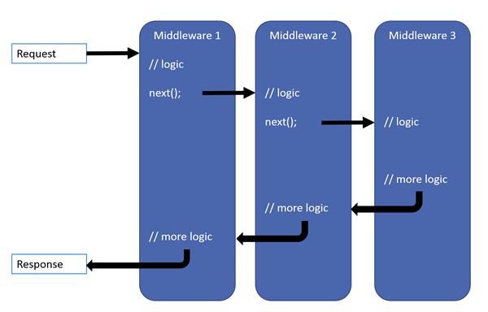

# middleware中间件
[English Document](https://farseer-go.gitee.io/en-us/)、[中文文档](https://farseer-go.gitee.io/)、[English Document](https://farseer-go.github.io/doc/en-us/)、[github Source](https://github.com/farseer-go/webapi)

> 中间件，是一种管道设计理念


?> 它允许我们在http的请求过程中，加入自定义的`非业务逻辑`，如`权限效验`、`记录日志`、`api性能统计`等等。

## 1、处理流程

> `http` -> `exception` -> `routing` -> `自定义` -> `handleMiddleware`

!> 除了自定义的中间件，http、exception、routing、handleMiddleware，都不需要我们显示加载。

## 2、内置的中间件
### 2.1、Http
负责将httpResponse的Body写入到输出流

### 2.2、exception
在执行业务api发生异常时，进行捕获处理

### 2.3、routing
对method不匹配的请求，进行拒绝

### 2.4、handleMiddleware
最后的处理流程，主要是将最终的请求，转发到具体的Action中

### 2.5、Cors
支持跨域请求，需要在web.Run()运行前，手动加载

### 2.6、apiResponse
支持对返回值做一层包装。apiResponse的结构为：
```go
type ApiResponse[TData any] struct {
	// 操作是否成功
	Status bool
	// 返回状态代码
	StatusCode int
	// 返回消息内容
	StatusMessage string
	// 不同接口返回的值
	Data TData
}
```
_运行结果：_

```json
{
    "Status": true,
    "StatusCode": 200,
    "StatusMessage": "成功",
    "Data": {
        "PageSize": 10,
        "PageIndex": 1
    }
}
```

## 2.7、session
开启session功能

## 3、加载中间件
要加载Session、Cors、apiResponse、或自定义的中间件，很简单。
```go
webapi.RegisterPOST("/projectgroup/tolist", projectGroupApp.ToPageList, "pageSize", "pageIndex")
webapi.UseSession()
webapi.UseCors()
webapi.UseApiResponse()

webapi.Run()
```
?> 加载顺序：先加载的先执行

## 4、自定义中间件
> 包：`"github.com/farseer-go/webapi/middleware"`
> 包：`"github.com/farseer-go/webapi/context"`

- 需要定义`struct`，并组合`context.IMiddleware`接口
- 实现`context.IMiddleware`接口

_context.IMiddleware.go_
```go
type IMiddleware interface {
	Invoke(httpContext *context.HttpContext)
}
```

_自定义示例：_
```go
type middlewareDemo struct {
    context.IMiddleware
}

func (receiver *middlewareDemo) Invoke(httpContext *context.HttpContext) {
	// 检查method
	if strings.ToUpper(httpContext.Route.Method) != httpContext.Method {
		// 响应码
		httpContext.Response.WriteCode(405)
		return
	}
	receiver.IMiddleware.Invoke(httpContext)
}
```

_执行顺序_

当调用了：`receiver.IMiddleware.Invoke(httpContext)`，将执行下一个中间件调用。

我们可以在`Invoke`执行前、或执行后，编写你的逻辑代码。

## 5、加载自定义中间件
加载中间件，只需要调用`webapi.RegisterMiddleware`即可：
```go
webapi.UseCors()
webapi.RegisterMiddleware(&middlewareDemo{})
webapi.Run()
```

!> 所有api请求执行时，都会执行这个自定义的中间件