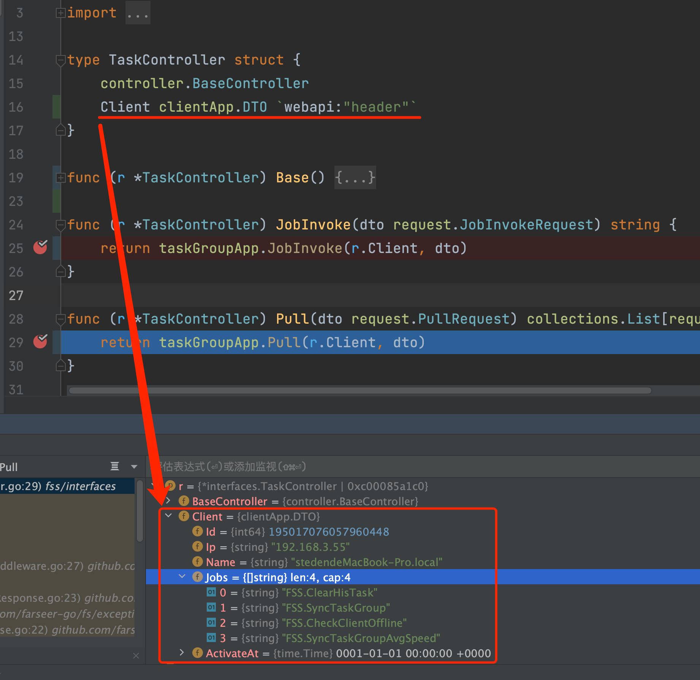

# 隐式绑定Header
[English Document](https://farseer-go.gitee.io/en-us/)、[中文文档](https://farseer-go.gitee.io/)、[English Document](https://farseer-go.github.io/doc/en-us/)、[github Source](https://github.com/farseer-go/webapi)

前面我们看到获取`入参`的时候，都是通过`隐式绑定`的，不需要我们做任何的赋值、json反序列化操作。

而`Header`也是同样`支持自动绑定`的。

## 1、手动获取
我们先看一下，手动获取时的操作：
```go
// GetClient 获取头部信息，并更新客户端
func (r *TaskController) GetClient() clientApp.DTO {
    return clientApp.DTO{
		Id:         parse.Convert(r.HttpContext.Header.GetValue("Clientid"), int64(0)),
		Ip:         strings.Split(r.HttpContext.Header.GetValue("Clientip"), ",")[0],
		Name:       r.HttpContext.Header.GetValue("Clientname"),
		Jobs:       strings.Split(r.HttpContext.Header.GetValue("Clientjobs"), ","),
	}
}
```
都是通过`r.HttpContext.Header.GetValue`方法来获取header key然后赋值的。

这不符合我们优雅、极简的定义。现在来看一下如何隐式绑定：

## 2、隐式绑定
```go
type TaskController struct {
	controller.BaseController
	Client clientApp.DTO `webapi:"header"`
}
```
在控制器中，我们添加一个字段，然后在标签中定义：`webapi:"header"`，这样在注册控制器时，就会开启隐式绑定规则。

`clientApp.DTO`是应用系统自定义的结构体，用来存放各项header value的：
```go
type DTO struct {
	Id         int64     `webapi:"Clientid"`   // 客户端ID
	Ip         string    `webapi:"Clientip"`   // 客户端IP
	Name       string    `webapi:"Clientname"` // 客户端名称
	Jobs       []string  `webapi:"Clientjobs"` // 客户端能执行的任务
}
```
标签：`webapi:"Clientid"`是告诉webapi组件，对应header的key是什么，不填则为字段名称。

这样就实现了隐式绑定功能。



怎么样，我们完全不需要一个个去上下文的header中获取再赋值了，是不是很省事。