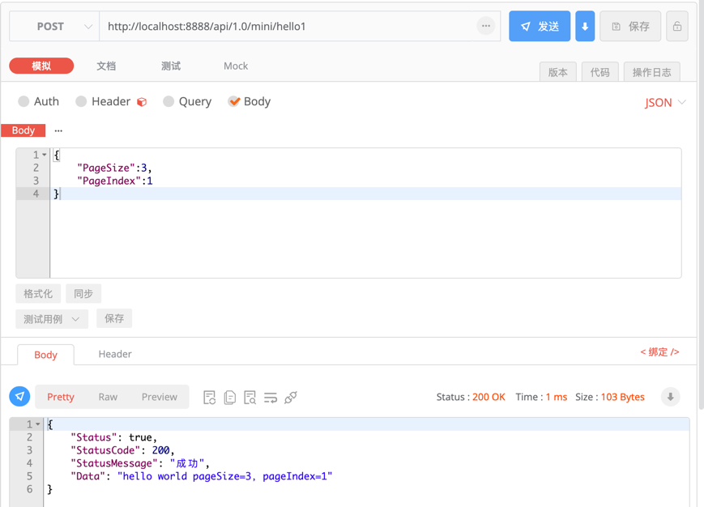
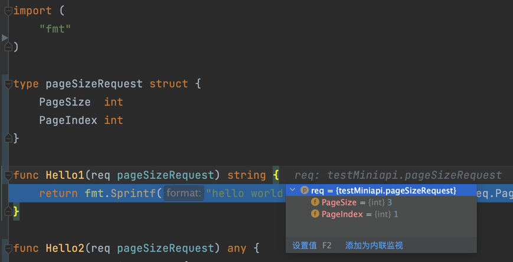

# webapi 概述
[English Document](https://farseer-go.gitee.io/en-us/)、[中文文档](https://farseer-go.gitee.io/)、[English Document](https://farseer-go.github.io/doc/en-us/)、[github Source](https://github.com/farseer-go/webapi)

> 包：`"github.com/farseer-go/webapi"`
>
> 模块：`webapi.Module`


[](https://codecov.io/gh/farseer-go/webapi)

[](https://github.com/farseer-go/webapi/actions/workflows/test.yml)


?> 用于快速构建api服务，带来极简、优雅的开发体验。编写api服务时，不需要使用httpRequest、httpResponse等数据结构。

webapi使用了中间件的管道模型编写，让我们加入非业务逻辑时非常简单。

包含两种风格来提供API服务：
- `MinimalApi`：动态API风格（直接绑定到逻辑层）
- `Mvc`：Controller、Action风格

?> 使用minimalApi时，甚至不需要UI层来提供API服务。

## 1、webapi有哪些功能
- 支持中间件
- 支持路由模板（友好的URL）显示
- 出入参自动绑定（支持model绑定）
- 支持静态目录绑定
- ActionFilter过虑器
- ActionResult抽象结果
- Area区域设置
- MinimalApi模式
- Mvc模式
  - HttpContext上下文
  - Header隐式绑定

大部份情况下，除了main需要配置webapi路由外，在你的api handle中就是一个普通的func函数，不需要依赖webapi组件。webapi会根据`func函数`的`出入参`来`隐式绑定数据`。

```go
func main() {
	fs.Initialize[webapi.Module]("FOPS")
	webapi.RegisterPOST("/mini/hello1", Hello1)
	webapi.RegisterGET("/mini/hello3/{pageSize}-{pageIndex}", Hello3)
	webapi.Run()
}

// 使用结构（DTO）来接收入参
// 返回string
func Hello1(req pageSizeRequest) string {
	return fmt.Sprintf("hello world pageSize=%d，pageIndex=%d", req.PageSize, req.PageIndex)
}

// 使用基础参数来接收入参
// 返回pageSizeRequest结构（会自动转成json)
func Hello3(pageSize int, pageIndex int) pageSizeRequest {
    return pageSizeRequest{
        PageSize:  pageSize,
        PageIndex: pageIndex,
    }
}

// 也可以定义一个结构，用于接收参数
type pageSizeRequest struct {
    PageSize  int
    PageIndex int
}
```
发起请求：


收到请求：


函数中，`出入参都会自动绑定数据`

?> 如果是`application/json`，则会自动被反序列化成model，如果是`x-www-form-urlencoded`，则会将每一项的key/value匹配到model字段中

可以看到，整个过程，`不需要`做`json序列化`、`httpRequest`、`httpResponse`的操作。

在webapi组件中，提供了两种风格：`minimalApi`、`mvc`。

## 2、使用哪种模式
### 2.1、`minimalApi`风格
`minimalApi`风格，非常的简单，不需要你依赖任何的webapi组件。对你的应用系统没有侵入性。
通常在我们的设计原则里面，依赖的越少越好。

另外`minimalApi`风格，我们也可以称为：`动态API`的方案。意味着，我们不需要在应用系统中专门分一个UI层来放API入口。而是直接通过路由绑定到业务层（或DDD中的应用层）

### 2.2、`mvc`风格
`mvc`风格，需要依赖`controller.BaseController`，但可以自动注册所有该控制器下的API方法。

`mvc`还支持`ActionFilter过滤器`，意味着在每个Action执行前后，支持做通用的逻辑处理。