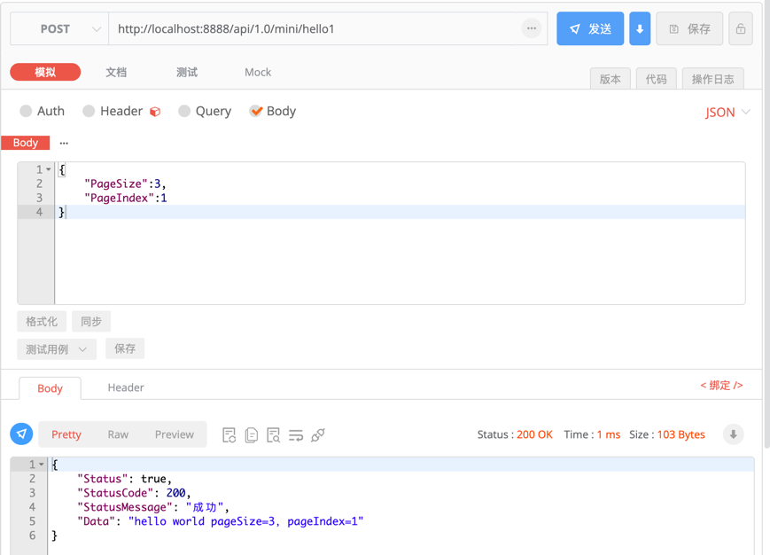

# 入参
[English Document](https://farseer-go.gitee.io/en-us/)、[中文文档](https://farseer-go.gitee.io/)、[English Document](https://farseer-go.github.io/doc/en-us/)、[github Source](https://github.com/farseer-go/webapi)

在webapi组件中，Api函数的入参、出参，看起来就是一个普通func函数的参数，并不需要依赖httpRequest、httpResponse。
    
入参支持两种模式：
- **DTO模式**：只有`1个struct`类型时，则会被认为是`model(dto)`模型
- **普通入参**：`不满足DTO模式`时，则会判定为`普通入参`

## 1、DTO模式
    支持前端以`application/json`或`x-www-form-urlencoded`方式传值。

- `x-www-form-urlencoded`：
- `application/json`：
- 收到请求：

?> 如果是`application/json`，则会自动被反序列化成model，如果是`x-www-form-urlencoded`，则会将每一项的key/value匹配到model字段中

## 2、普通入参
  同样支持前端以`application/json`或`x-www-form-urlencoded`方式传值。

- 收到请求：

!> 由于go无法通地反射函数来获取到参数的名称，因此需要显示指定参数的命名，以此来做到参数匹配。这就需要在注册时，显示指定：

```go
webapi.RegisterPOST("/mini/hello3", Hello3, "pageSize", "pageIndex")
```

?> 当入参只有一个时，不需要显示指定参数名称。

## 3、字段效验
我们使用了第三方成熟效验组件来集成到webapi中：`go-playground/validator` v10版本

要实现在请求的时候自动交验字段，只需要启用效验中间件即可：
```go
func main(){
    fs.Initialize[webapi.Module]("demo")
    webapi.UseValidate()  // 启用字段效验
    webapi.Run()
}
```
DTO示例：
```go
type DTO struct {
	Name string `validate:"required" label:"账号"`
	Age  int    `validate:"gte=0,lte=100" label:"年龄"`
}
```
后续在你的API接收DTO作为入参时，将会自动效验字段的合法性。

我们列举常用的一些字段规则：

| 标签       | 说明         |
|----------|------------|
| required | 必填         |
| alphanum | 字母数字       |
| contains | 包含         |
| number   | 数字         |
| email    | 邮箱地址       |
| boolean  | true/false |
| gte      | 值必须>=      |
| gt       | 值必须>       |
| lte      | 值必须<=      |
| lt       | 值必须<       |
| ne       | 值必须!=      |
| eq       | 值必须==      |
| len      | 字符串长度      |
| ip       | ip格式       |
| ipv4     | ip4格式      |
| url      | url格式      |
| eqfield  | 等于指定字段值    |

更多效验规则，请查看：https://github.com/go-playground/validator

?>我们做了中文的默认支持，请使用`label` tag来标记字段的中文名字